<div align="center">

# Bock Media

**Stream your own music library on any Amazon Echo — by voice, with no paid streaming service.**


&nbsp;·&nbsp; Python 3.10+ &nbsp;·&nbsp; Flask &nbsp;·&nbsp; vanilla-JS admin console &nbsp;·&nbsp; custom Alexa skill &nbsp;·&nbsp; Android / iOS apps

</div>

Bock Media is a self-hosted music server plus a **custom Alexa skill** that lets
any Echo play music straight off your own NAS or disk — playlists, artists,
albums, tracks, genres, even audiobooks — using your voice. No Spotify, no
Amazon Music subscription, no cloud middle-man. It indexes a local SQLite music
library, streams audio over a Cloudflare tunnel, and gives you a slick web
console to manage everything. **Native Android and iOS apps** share the same API
for home playback, offline downloads, and Now Playing on your phone.

> **Heads up — this is a personal/hobby project.** It glues together a custom
> Alexa skill, an *unofficial* Alexa control API, and an optional Plex
> integration. It works great for a home setup but is **not** an official Amazon
> product and is not intended for commercial use. See [Caveats](#caveats).

LIVE DEMO : https://bock-media.onrender.com 
It might take a min to spin up.  Give it time!

---

## Contents

- [Screenshots](#screenshots)
- [Features](#features)
- [Try it in 2 minutes (demo data)](#try-it-in-2-minutes-demo-data)
- [Architecture](#architecture)
- [Requirements](#requirements)
- [Full setup](#full-setup)
- [Configuration reference](#configuration-reference)
- [Voice commands](#voice-commands)
- [Repository layout](#repository-layout)
- [Testing](#testing)
- [Troubleshooting](#troubleshooting)
- [Caveats](#caveats)
- [License](#license)

---

## Screenshots

> All screenshots below were generated from the bundled **demo dataset**
> (`scripts/seed_demo_data.py` or `scripts/seed_demo_library.py`) — the library,
> devices, and listening history are entirely fictional.

### Home feed & Now Playing

| Home | Now Playing | Your Library |
|:---:|:---:|:---:|
| 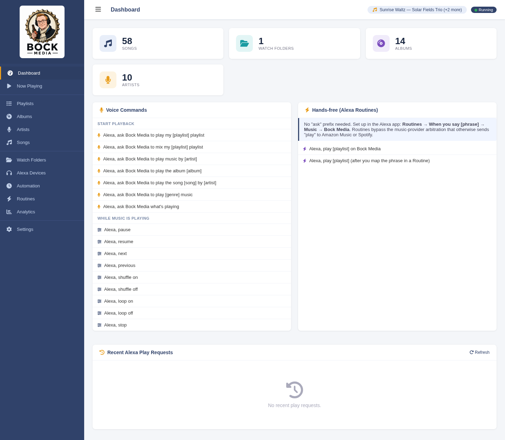 | 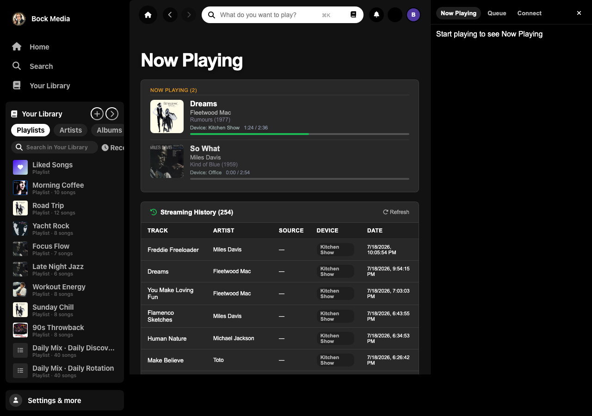 | 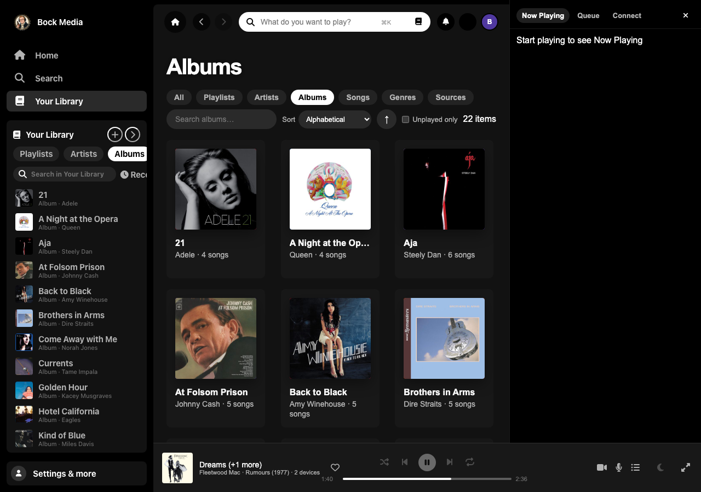 |

### Dashboard
The **Home** tab shows Spotify-style mixes, genre radio, and mood rows (above). The classic dashboard counts and voice cheat sheet live under the same route when you scroll or use older nav links.


### Now Playing
Live per-device playback pulled from Alexa `AudioPlayer` events, with a paused badge, a sleep-timer control, and the full streaming history below.


### Analytics
Chart.js dashboards over your listening history: activity over time, hour-of-day and day-of-week, a listening heatmap, top artists/albums/tracks/devices, genres, and decades.

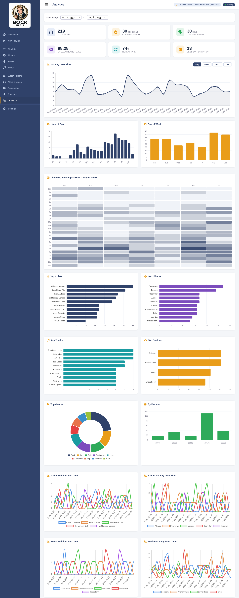

### Playlists
Every playlist Bock Media has indexed (from `.m3u`/`.m3u8`/`.pls` files or synced from Plex). Rename in place — Alexa recognizes the new name instantly.

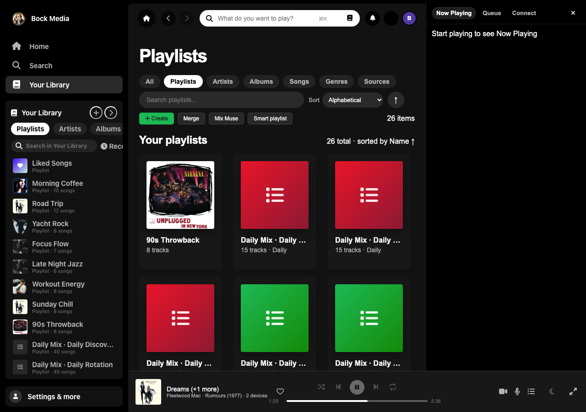

### Songs / Albums / Artists
Fast, paginated, searchable browsers over the `songs_cache` index.


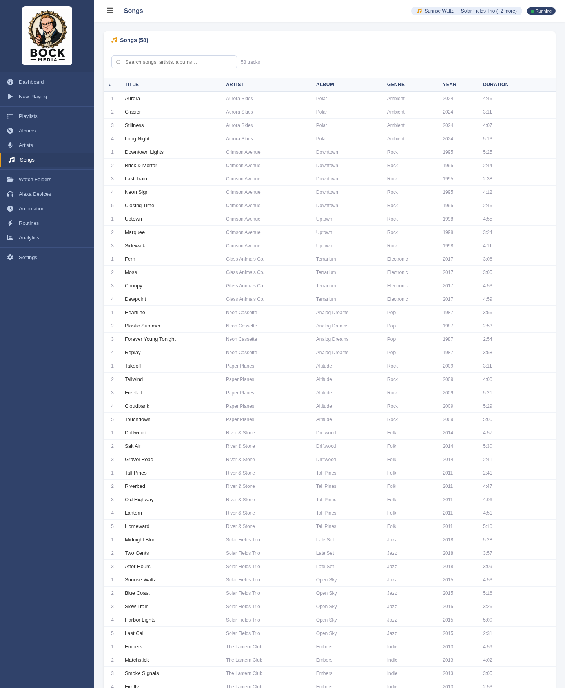

### Alexa Devices
Every Echo that has streamed via Bock Media. Rename them, merge duplicates left behind by Alexa device-id rotation, and build multi-room device groups.

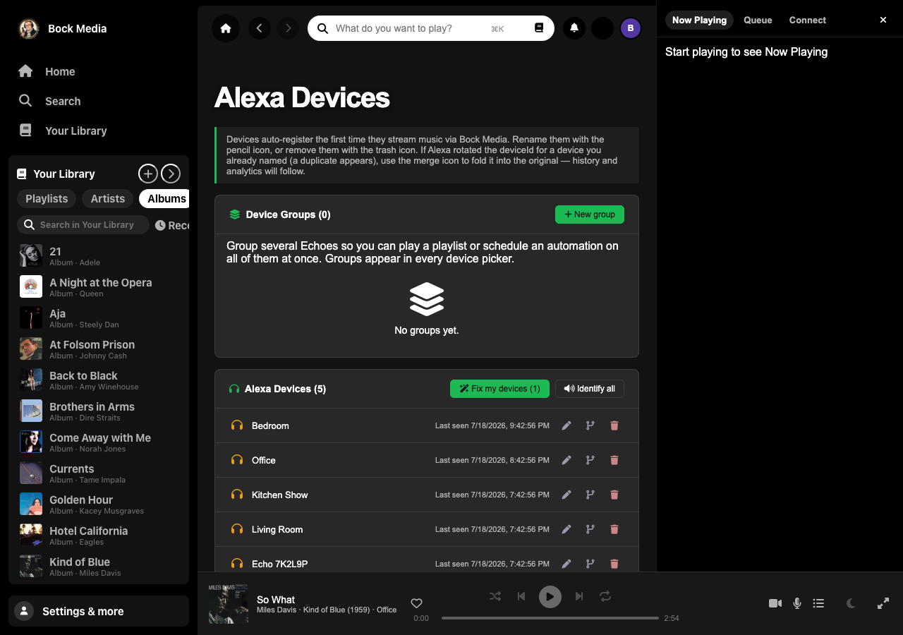

### Family profiles
Household members, room ownership, and kid-safe approval — see [`docs/SETUP.md`](docs/SETUP.md).

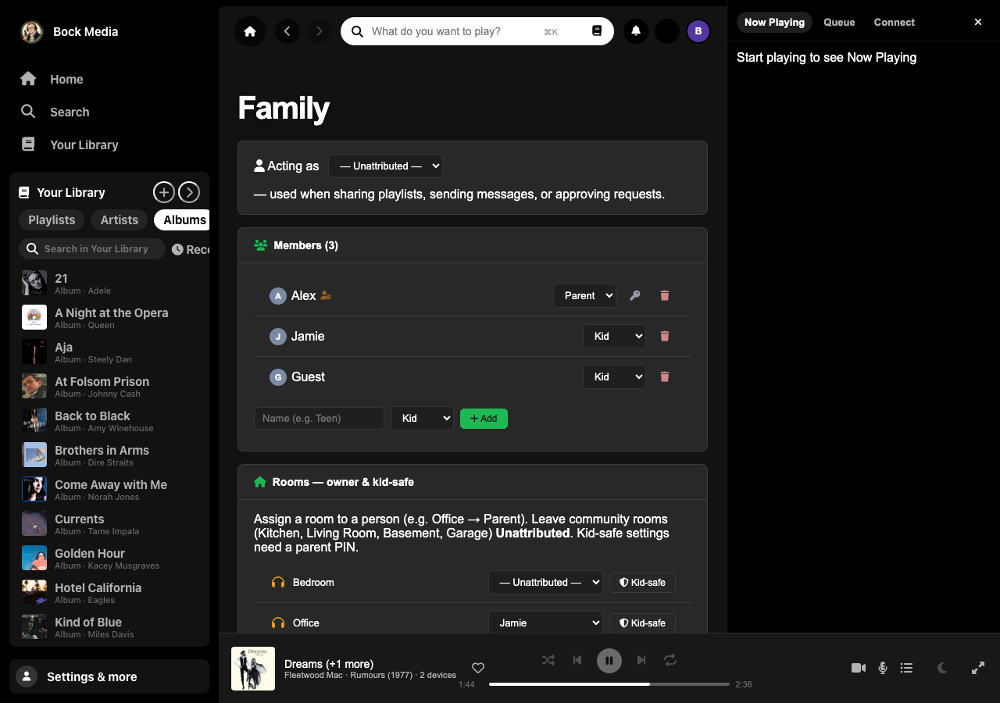

### Routines builder
Amazon doesn't let apps create Routines, so this builds the exact wording for you to paste into the Alexa app — enabling hands-free, no-"ask" playback.

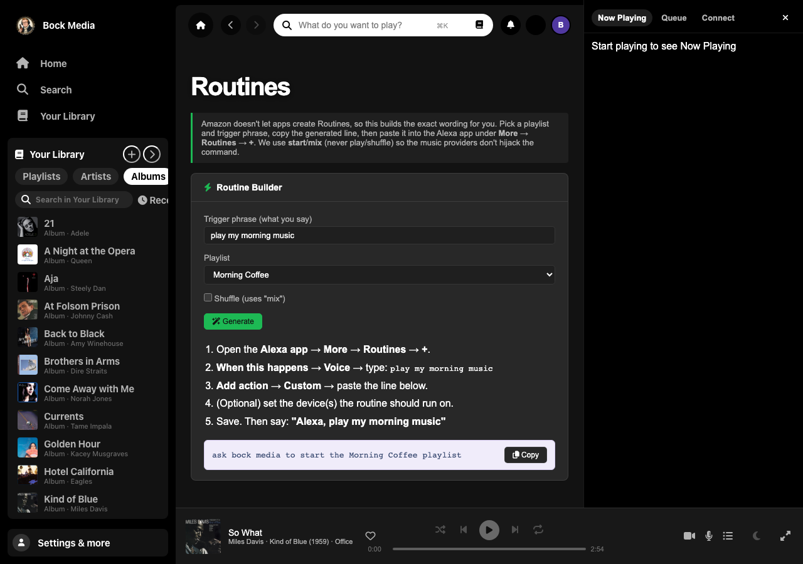

### Automation

Schedule a playlist to start on a specific Echo at a set time. Automations use the
same unofficial remote-control path as **Play on device** on the Playlists page
(`start` / `mix` commands via `alexapy`). You need `alexaRemote` in `config.json`
and a one-time login via `scripts/alexa_login.py` (see
[step 6](#6-optional-play-on-device--automation) in Full setup).

#### Before Alexa remote is configured

Until credentials exist, the page shows a setup notice and an empty scheduled list:

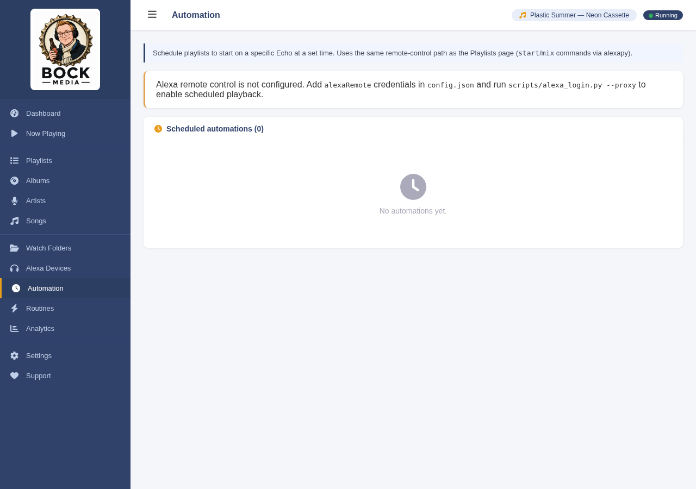

#### Creating an automation

Once remote control is configured, a **New automation** card appears at the top of
the page. Fill in:

| Field | What you choose |
| --- | --- |
| **Label** | Optional friendly name (e.g. *Morning Coffee*) |
| **Playlist** | Type to search indexed playlists; pick one from the results list under the field |
| **Device** | Target Echo (or device group) |
| **Time** | 24-hour local time the server should fire |
| **Repeat** | Daily, Weekdays, Weekends, or Custom (per-day chips) |
| **Shuffle** | When checked, fires with `mix` instead of `start` |
| **Enabled** | Uncheck to pause the schedule without deleting it |

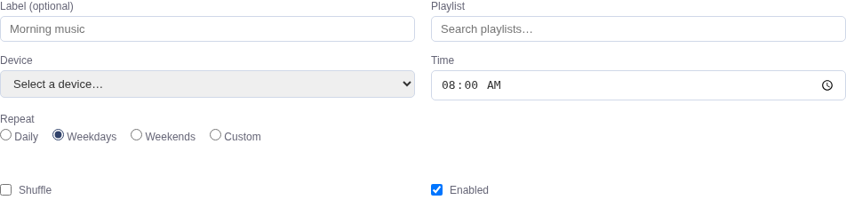

Click **Add automation** to save. The backend scheduler checks every minute and
sends the voice-style command through alexapy when the clock and day list match.

#### Scheduled automations list

Saved jobs appear in the table below — time, repeat pattern, last run, and status.
Row actions: **Run now**, enable/disable, edit, delete.

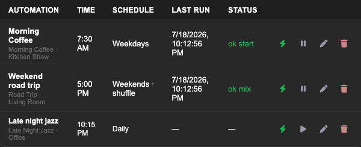

Full page (form + list) for reference:

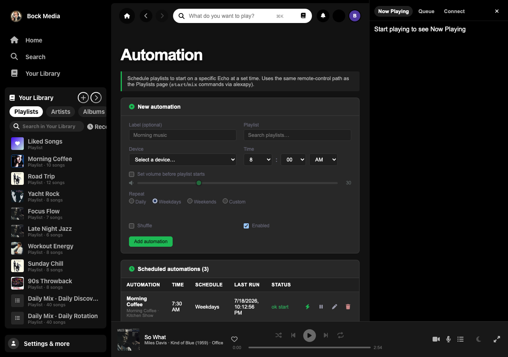

### Watch Folders & Settings
<table>
<tr>
<td width="50%">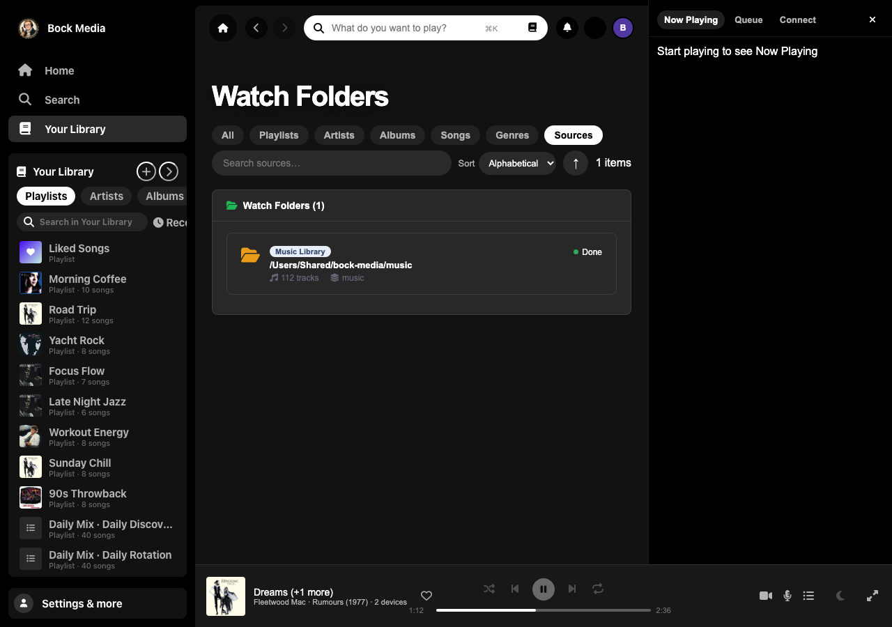</td>
<td width="50%">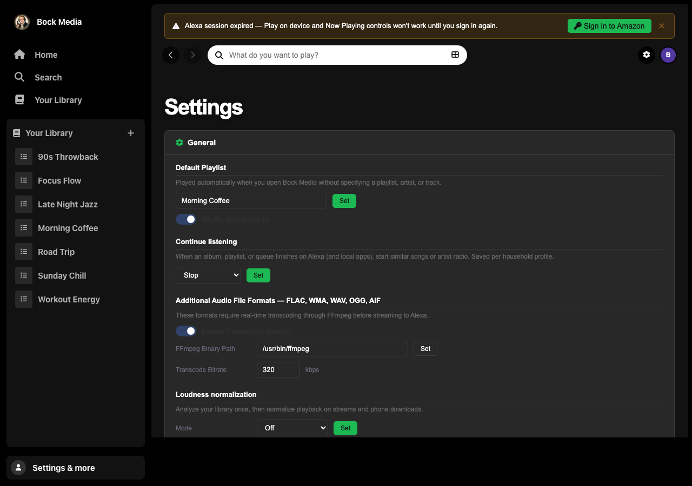</td>
</tr>
</table>

---

## Features

### 🎙️ Voice control on any Echo
- A **custom Alexa skill** ("bock media") that plays playlists, artists, albums,
  tracks, and genres from your local library.
- Robust **fuzzy matching** — falls back playlist → artist → album → track when a
  spoken name isn't an exact match, and strips invocation bleed-through
  (`"ask bock media to..."`) that sometimes leaks into slot values.
- Full `AudioPlayer` transport: pause, resume, **next/previous**, shuffle, loop.
- **Sleep timer & stop-after-N**: *"…stop after this song"*, *"…stop after 3
  songs"*, *"…set a sleep timer for 20 minutes"*.
- **"Never play again"**: *"…never play this again"* permanently skips a track;
  manage the ignore list from the Analytics page.
- **Add to playlist by voice** with optional two-way write-back to Plex.

### 📊 Web admin console (LAN)
A single-page app with a dark sidebar — Home, Search, Your Library, Now Playing,
Playlists, Albums, Artists, Songs, Watch Folders, Alexa Devices, Automation,
Routines, Analytics, Settings, Family — all backed by JSON endpoints. Includes:
- A **Service Health** card (backend, tunnel, Alexa session, Plex) on the dashboard.
- **Home feed** — mixes, genre radio, mood rows, jump back in.
- **Your Library** — sort and filter artists, albums, songs, genres, and sources.
- Rich **Analytics** built from an append-only `streaming_history.jsonl`.
- In-place **playlist renaming** that Alexa picks up immediately.

### 🎬 Music videos (Now Playing)
When a track is playing, clients resolve a matching **YouTube music video** and
stream it **through your server** (yt-dlp + optional Deno), so embeds are not
blocked in WebViews. Web, Android, and iOS Now Playing show cover art or video.
See [`docs/MUSIC_VIDEO.md`](docs/MUSIC_VIDEO.md).

### 📱 Native mobile apps (`android/`, `ios/`)
- **Jetpack Compose** (Android) and **SwiftUI** (iOS) clients with the same REST API.
- Local phone playback, **offline downloads**, driving mode, and Now Playing.
- **Who's listening?** profile picker and per-profile downloads/settings.
- Home screen **shortcuts**: Now Playing, Playlists, Rooms, Search.
- Self-hosters can expose a sideload APK at **`/app`** (see screenshot above).

### 👨‍👩‍👧‍👦 Family & kid-safe rooms
- Household **members** (parent / kid / guest) with optional parent PIN.
- Assign Echo rooms to a person; kid-safe rooms can **queue** tracks until a parent approves.
- Per-profile ratings, playlists, and client preferences sync via the server.

### 🔊 "Play on device" & multi-room
- Push a playlist to a **specific Echo** straight from the web UI (▶ on any
  playlist row), via the unofficial Alexa API (`alexapy`).
- **Schedule** playlists to start on a chosen device at a set time (Automation).
- **Device groups** + **group-aware Now Playing** that collapses a multi-room
  group into a single row.

### 🧭 Resilient device identity
- Echoes auto-register the first time they stream.
- **Serial-indexed auto-aliasing** folds a rotated `deviceId` back onto the same
  physical speaker so history/analytics stay attached.
- **Guided "Fix my devices"** flow plays a short clip on each unnamed Echo so you
  can label rooms (test/identify plays are excluded from analytics).

### 🎵 Audio streaming + artwork
- `/stream/<path>` streams `.mp3/.m4a/.aac` natively with HTTP Range support and
  transcodes `.flac/.wma/.wav/.ogg/.aif(f)` on the fly via `ffmpeg`.
- `/artwork/<path>` resolves art in four tiers — sidecar files → embedded
  ID3/MP4 tags ([mutagen](https://mutagen.readthedocs.io/)) → sibling album
  tracks → iTunes Search API — cached on disk.

### 🔁 Plex playlist sync (optional)
- `scripts/sync_plex_playlists.py` pulls audio playlists directly from a local
  Plex server into Bock Media (near real-time CRUD, incremental).
- Voice "add this to <playlist>" can **write back** to the Plex playlist.

### 🔐 Security
- The public tunnel only exposes `/alexa`, `/stream/`, `/artwork/`, `/music`, and
  `/oauth/`; everything else is hard-rejected for tunneled requests.
- Full Alexa **request-signature verification**: cert URL validation, SAN check,
  RSA-SHA1 signature, ±150 s timestamp window, and `applicationId` pinning.
- Optional HTTP Basic auth for the LAN console (`WebPassword` preference).

### 🧪 Quality
- A `pytest` suite (API + Alexa intents + regressions) and a `jsdom` UI test
  suite, wired into **GitHub Actions** CI.
- A **health watchdog** (`scripts/health_check.py` + a systemd timer) that
  restarts the stack if the tunnel or backend goes unhealthy.

---

## Try it in 2 minutes (demo data)

You can explore the entire web console **without any music, Alexa hardware, or
Plex** — just seed the bundled demo dataset and run the server:

```bash
git clone https://github.com/andystumpf/bock-media.git
cd bock-media
pip install -r requirements.txt

# Generate a fictional library + playlists + devices + listening history
python3 scripts/seed_demo_data.py --config --alexa-remote
# — or use the committed fixture (no Alexa remote stub):
# python3 scripts/seed_demo_library.py

# Run the server against the demo data
OURMEDIA_DATA_DIR=$PWD/demo-data \
OURMEDIA_DB_PATH=$PWD/demo-data/music_organizer.db \
OURMEDIA_MUSIC_ROOT=$PWD/demo-data/music \
PORT=3001 python3 server.py
```

Open <http://localhost:3001/> and click through every page. The screenshots
above are exactly what you'll see. (The demo data lives in `demo-data/` and is
gitignored; delete the folder to remove it.)

### Live demo on Render

The repo includes a [Render Blueprint](https://render.com/docs/blueprint-spec)
(`render.yaml`) that builds the fictional demo library on deploy and serves the
web console. Alexa skill / tunnel features are **not** available on Render — this
is for browsing the UI and API with test data only.

1. Sign in at [render.com](https://render.com) and choose **New → Blueprint**.
2. Connect the public `andystumpf/bock-media` repo (Render reads `render.yaml`).
3. Apply the blueprint — service name **bock-media-demo**, Free plan is fine.
4. Wait for the build (`seed_demo_data.py` + `pip install`) and open the `.onrender.com` URL.

Render sits behind a CDN that sends Cloudflare-style headers; the app detects `RENDER`
and allows the web console (home installs still block tunneled access to `/` unless
you set `OURMEDIA_ALLOW_PUBLIC_CONSOLE=true`).

Health check: `GET /api/summary`. On first boot, `scripts/render_start.sh` re-seeds
if the DB is missing (ephemeral disk on Free tier is wiped on redeploy; the build
step seeds again each deploy).

---

## Architecture

```
            Voice  ┌─────────────┐   HTTPS    ┌──────────────────┐
  "Alexa, ask ───▶ │  Amazon /   │ ─────────▶ │ Cloudflare named │
   bock media …"   │  Echo       │            │ tunnel (fixed    │
                   └─────────────┘            │ public hostname) │
                          ▲                   └────────┬─────────┘
            AudioPlayer    │ stream + metadata          │ /alexa /stream /music
            directives     │                            ▼
                   ┌───────┴──────────────────────────────────────┐
                   │  Flask backend  (server.py, :3001)            │
                   │  • Alexa skill handler + signature verify     │
                   │  • /stream  /artwork  (ffmpeg transcode)      │
                   │  • JSON API for the web console               │
                   │  • optional MSP /music + /oauth scaffold      │
                   └───┬───────────────┬───────────────┬───────────┘
                       │               │               │
              SQLite   │        XML +  │      unofficial│ Alexa API
           songs_cache │   ServerPlay- │       (alexapy)│  "play on device"
                       │   lists.xml   │               ▼
                   ┌───┴───┐      ┌────┴─────┐   ┌──────────────┐
                   │ music │      │ ~/.bock  │   │ your Echoes  │
                   │ files │      │ media/   │   │ (multi-room) │
                   └───────┘      └──────────┘   └──────────────┘
                       ▲
              optional │ playlist sync / write-back
                   ┌───┴───┐
                   │ Plex  │
                   └───────┘
```

Bock Media stores no machine-specific paths in code — three env vars relocate
everything (see [Configuration](#configuration-reference)).

---

## Requirements

- **Python 3.10+** and **ffmpeg** on `PATH` (for non-MP3 formats).
- A **`songs_cache` SQLite index** of your library (table schema below). If you
  already use a local media indexer that writes `ServerPlaylists.xml` /
  `WatchFolders.xml`, point Bock Media at its data dir. Otherwise the demo seed
  script shows the exact schema to populate.
- A **Cloudflare account + named tunnel** with a public hostname → `http://127.0.0.1:3001`.
- An **Amazon Developer account** to host the custom skill (development mode is fine).
- *(Optional)* a local **Plex** server for playlist sync, and Amazon account
  credentials for "Play on device".

### `songs_cache` schema

```sql
CREATE TABLE songs_cache (
  id INTEGER PRIMARY KEY,
  title TEXT, artist TEXT, album_artist TEXT, album TEXT,
  genre TEXT, year INTEGER, duration_seconds INTEGER,
  bitrate INTEGER, track_number INTEGER, path TEXT
);
```

`path` must be a readable absolute path under `$OURMEDIA_MUSIC_ROOT`.

---

## Full setup

### 1. Install

```bash
git clone https://github.com/andystumpf/bock-media.git
cd bock-media
pip install -r requirements.txt
cp config.example.json config.json     # then edit (see Configuration)
```

### 2. Point at your library

Set three environment variables (the systemd unit declares them — see step 4):

| Variable | Default | Purpose |
| --- | --- | --- |
| `OURMEDIA_DB_PATH` | `/srv/music/music_organizer.db` | SQLite `songs_cache` index |
| `OURMEDIA_DATA_DIR` | `~/.bockmedia` | XML config (`ServerPlaylists.xml`, `WatchFolders.xml`, `Preferences.xml`) + image cache |
| `OURMEDIA_MUSIC_ROOT` | `/srv/music` | Music library root |

Run it:

```bash
PORT=3001 python3 server.py     # or ./start.sh
```

Open `http://<host>:3001/` on your LAN.

### 3. Cloudflare named tunnel

Create a named tunnel and a permanent hostname, then `~/.cloudflared/config.yml`:

```yaml
tunnel: <your-tunnel-uuid>
credentials-file: /home/youruser/.cloudflared/<your-tunnel-uuid>.json
ingress:
  - hostname: your-domain.example.com
    service: http://127.0.0.1:3001
  - service: http_status:404
```

```bash
cloudflared tunnel route dns <tunnel-name> your-domain.example.com
```

> A named tunnel gives you a **fixed** public hostname (quick tunnels rotate and
> will break the skill). Latency to the tunnel must stay under ~2 s — Alexa times
> out at 8 s.

### 4. Run as a systemd stack

```bash
cp ourmedia.service.example ourmedia.service     # edit paths/user + OURMEDIA_SKILL_ID
sudo cp ourmedia.service       /etc/systemd/system/
sudo cp ourmedia-stack.target  /etc/systemd/system/
sudo cp ourmedia-health.service ourmedia-health.timer /etc/systemd/system/
sudo systemctl daemon-reload
sudo systemctl enable --now ourmedia-stack.target ourmedia-health.timer
```

Create a `ourmedia-tunnel-named.service` that runs `cloudflared tunnel run
<tunnel-name>` (machine-specific, not shipped here) and add it to the target.

### 5. Deploy the Alexa skill

1. Create a custom skill in the [Alexa Developer Console](https://developer.amazon.com/alexa/console/ask),
   enable the **AudioPlayer** interface, and set the endpoint to
   `https://your-domain.example.com/alexa`.
2. Set `OURMEDIA_SKILL_ID` in `ourmedia.service` (and in
   `skill/manifest.development.json`). Without it, automations utterances reach
   Echo but the server rejects the skill callback (`applicationId mismatch`).
3. Upload the interaction model with [`ask-cli`](https://developer.amazon.com/en-US/docs/alexa/smapi/quick-start-alexa-skills-kit-command-line-interface.html):

```bash
ask smapi set-interaction-model \
  -s <your-skill-id> -g development -l en-US \
  --interaction-model "file:skill/interaction_model.json"

ask smapi get-skill-status --skill-id <your-skill-id> --resource interactionModel  # wait for SUCCEEDED
ask smapi set-skill-enablement --skill-id <your-skill-id>
```

Helper to keep the endpoint URI in sync after a hostname change:

```bash
python3 scripts/sync_alexa_public_url.py https://your-domain.example.com
```

Amazon's developer-mode testing lapses on its own; a cron keeps it alive:

```cron
0 */6 * * * ask smapi set-skill-enablement --skill-id <your-skill-id>
```

### 6. (Optional) "Play on device" + Automation

These use the *unofficial* Alexa API via `alexapy`:

```bash
pip install "alexapy==1.26.9" "aiohttp>=3.10,<3.11"   # the aiohttp pin is required
```

Add `alexaRemote` credentials to `config.json`, then log in once via the proxy
helper (handles modern Amazon login / passkey accounts):

```bash
python3 scripts/alexa_login.py --proxy --host <lan-ip> --port 3005
# open http://<lan-ip>:3005 and sign in
```

The ▶ button on playlist rows and the Automation page appear once this is configured.

### 7. (Optional) Plex playlist sync

Point Bock Media at a local Plex server and run the sync (a cron every few
minutes keeps it current):

```bash
python3 scripts/sync_plex_playlists.py          # incremental
python3 scripts/sync_plex_playlists.py --force   # full re-pull
```

---

## Configuration reference

Copy `config.example.json` → `config.json` and fill in:

| Key | Meaning |
| --- | --- |
| `publicUrl` | Your fixed tunnel hostname, e.g. `https://your-domain.example.com` |
| `launchPlaylistPrompt` | `true` → *"Alexa, open bock media"* asks for a playlist and stays in-session (handy when Spotify steals one-shots). `false` → immediately plays the `DefaultPlaylist` preference. |
| `identifyPlaylist` | Playlist used for the "Fix my devices" identify clips. |
| `msp` / `mspOauth` | Optional Music Skill (MSP) ids + OAuth client (experimental). |
| `alexaRemote` | Optional Amazon creds for "Play on device" / Automation. |

Library preferences (Default Playlist, ffmpeg path, web password, logging, …)
live in `Preferences.xml` and are editable from the **Settings** page.

**Secrets never get committed** — `config.json`, `skill/account-linking.json`,
`devices.json`, runtime state, and the generated MSP catalog are all in
`.gitignore`. Templates are provided as `*.example.json`.

---

## Voice commands

Invocation name: **"bock media"**. Collision-safe verbs are **`start`** and
**`mix`** (Amazon's music domain tends to hijack `play`/`shuffle` + a music-like
name).

| Intent | Example utterance |
| --- | --- |
| `PlayPlaylistIntent` | *"Alexa, ask bock media to start the road trip playlist"* |
| `ShufflePlaylistIntent` | *"Alexa, ask bock media to mix the road trip playlist"* |
| `PlayArtistIntent` / `ShuffleArtistIntent` | *"Alexa, ask bock media to play River and Stone"* |
| `PlayAlbumIntent` / `ShuffleAlbumIntent` | *"Alexa, ask bock media to play the album Tall Pines"* |
| `PlayTrackIntent` / `PlayTrackByArtistIntent` | *"Alexa, ask bock media to play Driftwood by River and Stone"* |
| `PlayGenreIntent` / `ShuffleGenreIntent` | *"Alexa, ask bock media to play some jazz"* |
| `AddToPlaylistIntent` | *"Alexa, ask bock media to add this to my road trip playlist"* |
| `SleepTimerIntent` / `StopAfterIntent` | *"…set a sleep timer for 20 minutes"* / *"…stop after 3 songs"* |
| `IgnoreSongIntent` | *"Alexa, ask bock media to never play this again"* |
| `WhatsPlayingIntent` / `PlayCurrentIntent` | *"Alexa, what's playing?"* / *"…play this"* |
| `AMAZON.{Pause,Resume,Next,Previous,Stop,Shuffle*,Loop*}` | Standard transport controls |

For true hands-free, no-"ask" playback, use the **Routines builder** page to
generate a phrase and paste it into an Alexa Routine.

---

## Repository layout

```
.
├── server.py                     # Flask app — all routes, Alexa handler, helpers
├── alexa_remote.py               # Unofficial Alexa API wrapper (alexapy)
├── plex_client.py                # Plex API client (playlist write-back, status)
├── start.sh                      # Trivial launcher
├── requirements.txt
├── config.example.json           # → copy to config.json (gitignored)
├── ourmedia.service.example      # → systemd unit for the backend
├── ourmedia-stack.target         # Aggregate target (backend + tunnel + health)
├── ourmedia-health.service/.timer# Health watchdog
├── public/                       # Static admin console (vanilla JS + Chart.js)
│   ├── index.html
│   ├── css/  js/app.js  img/
├── skill/
│   ├── interaction_model.json    # ASK interaction model
│   ├── manifest.development.json # custom-skill manifest
│   ├── music-manifest.json       # MSP (music skill) manifest
│   ├── account-linking.example.json
│   └── catalog_playlists.example.json
├── scripts/
│   ├── seed_demo_data.py         # generate the demo library (for screenshots/trying it)
│   ├── seed_demo_library.py      # lighter committed fixture seed
│   ├── capture_readme_screenshots.mjs  # regenerate img/screenshots/*.png
│   ├── capture_automation_screenshots.mjs  # regenerate Automation README images
│   ├── sync_plex_playlists.py    # Plex → Bock Media playlist sync
│   ├── sync_alexa_public_url.py  # resync skill endpoint via SMAPI
│   ├── health_check.py           # stack watchdog
│   └── … (catalog build/upload, audits, login helper)
├── tests/                        # pytest (API/Alexa/regressions) + tests/ui (jsdom)
├── android/                      # Jetpack Compose Android app
├── ios/                          # SwiftUI iOS app
├── fixtures/demo-data/             # committed fictional demo library (optional)
├── docs/SETUP.md                 # self-host setup notes
├── docs/MUSIC_VIDEO.md           # Now Playing music video pipeline
├── docs/AMAZON_UK.md             # Amazon UK (amazon.co.uk) config
├── .github/workflows/ci.yml
└── DEVICE_TEST_PLAN.md           # manual real-device test checklist
```

---

## Testing

```bash
pip install pytest
pytest tests/

# UI tests
cd tests/ui && npm install && npm test
```

`tests/conftest.py` redirects every writable path into a per-test `tmp_path`,
seeds isolated XML/state, and provides a Flask test client plus an
`alexa_request()` envelope builder. GitHub Actions runs both suites on push/PR.

For features that need real hardware (multi-room, device identity, sleep timer
boundaries), follow [`DEVICE_TEST_PLAN.md`](DEVICE_TEST_PLAN.md).

---

## Troubleshooting

```bash
sudo systemctl is-active ourmedia ourmedia-tunnel-named   # stack up?
grep "POST /alexa\|ALEXA" server.log | tail -20            # did Alexa reach us?
curl -o /dev/null -s -w "total=%{time_total}s\n" \
  https://your-domain.example.com/alexa -X POST -H "Content-Type: application/json" -d '{}'
```

If the skill suddenly routes to Spotify or returns *"the requested skill did not
provide a valid response"*, check in order:

1. **Tunnel down** → `systemctl restart ourmedia-tunnel-named`
2. **Backend down** → `systemctl restart ourmedia`
3. **Developer-mode enablement lapsed** → re-run `ask smapi set-skill-enablement`
4. **Music-domain collision** → say **mix**/**randomize** instead of
   **shuffle**, or set Amazon Music as the default music service in the Alexa app.

The full operations notes are in [`docs/SETUP.md`](docs/SETUP.md).

---

## Caveats

- **Unofficial Alexa API.** "Play on device" and Automation rely on `alexapy`
  (the same library Home Assistant uses). Amazon can change it without warning;
  cookies expire and need re-login.
- **One-shot music routing.** Amazon's music domain often claims
  *"Alexa, play <name>"* before a custom skill sees it. Use the "ask bock media
  to start/mix …" phrasing, a Routine, or set Amazon Music as default. This is a
  platform limitation, not a bug.
- **Personal use.** Built for a private home library. It is not certified for
  public Alexa skill distribution and ships no license to redistribute content.

---

## License

See [LICENSE](LICENSE). **Bock Media** is a trademark of Andy Stumpf. Personal,
non-commercial use only unless you obtain written permission. To support
development, use the **Support** page in the web console (PayPal hosted button
and Venmo QR).

---

## Support

Tips help keep Bock Media maintained. PayPal hosted button and Venmo QR on **Support** /
**Settings** in the web console; Venmo also below:

<p align="center">
  
</p>
