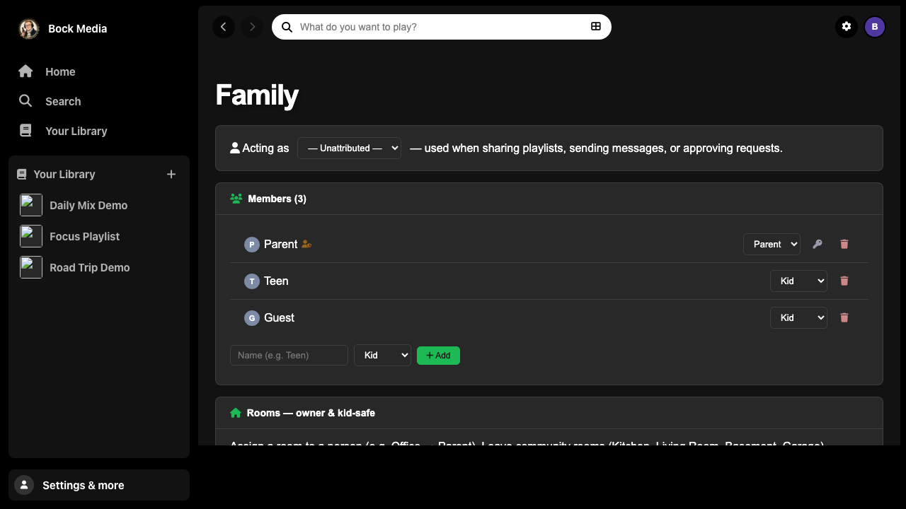

# Bock Media


Self-hosted music server, **custom Alexa skill**, and **native Android / iOS apps** — stream your own library on Echo speakers and phones without a subscription service.

Built around a Flask backend, a Spotify-style web console, and optional Music Skill Provider (MSP) scaffolding.

---

## Screenshots

> Demo library only — fictional artists and rooms. See [`fixtures/demo-data/`](fixtures/demo-data/).

| Web dashboard | Now Playing + music video | Android home |
|:---:|:---:|:---:|
|  |  |  |

| iOS Now Playing | Family profiles | Download page |
|:---:|:---:|:---:|
|  |  |  |

---

## Highlights

### Music videos (Now Playing)

When a track is playing, clients resolve a matching **YouTube music video** and stream it **through your server** (yt-dlp + optional Deno), so embeds are not blocked in WebViews.

- Web, Android, and iOS Now Playing show **cover art or video**
- Server routes: `/api/music-video`, `/api/music-video/{id}/play`, `/api/music-video/{id}/proxy`
- See [`docs/MUSIC_VIDEO.md`](docs/MUSIC_VIDEO.md)

### Web console

- **Home feed** — mixes, radio, browse by genre, daily mixes, moods, jump back in
- **Browser playback** — listen on your laptop (`WebPlayback.js`)
- **Library** — sort/filter artists, albums, songs, genres, sources
- **Now Playing** — multi-room Alexa control, queue, lyrics, **music video panel**
- **Playlists, search, analytics, family, devices, settings**

### Mobile apps (`android/`, `ios/`)

- Native **Jetpack Compose** (Android) and **SwiftUI** (iOS)
- Local phone playback, offline downloads, driving mode
- Profile picker (“Who’s listening?”), household attribution
- Home screen **shortcuts**: Now Playing, Playlists, Rooms, Search
- Build from source; self-hosters can expose APK/IPA at `/app`

### Alexa

- Custom skill — *“Alexa, ask bock media to start the road trip playlist”*
- Fuzzy playlist / artist / album / genre matching
- Optional MSP OAuth scaffold for Music Skill API experiments

### Security (self-hosted)

- Cloudflare tunnel: Alexa paths only; admin API blocked unless configured
- Direct port-forward: Basic auth + mobile Bearer token; signed `/stream/` URLs on LAN
- See [`docs/SETUP.md`](docs/SETUP.md)

### Regional

- **Amazon UK** (`amazon.co.uk`) — config-only; coexists with US installs. [`docs/AMAZON_UK.md`](docs/AMAZON_UK.md)

---

## Quick start (demo)

```bash
git clone https://github.com/andystumpf/bock-media.git
cd bock-media
pip install flask cryptography mutagen
python3 scripts/seed_demo_library.py

export OURMEDIA_DATA_DIR="$PWD/fixtures/demo-data"
export OURMEDIA_DB_PATH="$PWD/fixtures/demo-data/songs_cache.db"
python3 server.py
```

Open **http://127.0.0.1:3001/** — fictional **Demo Artist**, **Sample Band**, etc.

Copy `config.example.json` → `config.json` in your data dir for production.

Full setup: [`docs/SETUP.md`](docs/SETUP.md)

---

## Repository layout

```
server.py              Flask API + static web app
public/                Web SPA (home feed, library, Now Playing)
android/               Bock Media Android app
ios/                   Bock Media iOS app
skill/                 Alexa interaction model + manifests
scripts/               Deploy helpers, demo seed, Alexa login
fixtures/demo-data/    Fictional library (safe to publish)
tests/                 pytest + Playwright
docs/                  Setup, music video, Amazon UK, screenshots
```

---

## Mobile downloads

When self-hosting, build release APK/IPA and serve from **`/app`** (see `app-release-notes.json`). The web dashboard shows download links when `/api/app/info` reports a build.

---

## Contributing

Issues and PRs welcome on [GitHub](https://github.com/andystumpf/bock-media/issues).

Please do **not** commit `config.json`, cookies, API tokens, or real household data.

---

## License

See repository license file. Alexa skill assets follow Amazon Developer Terms when published.
