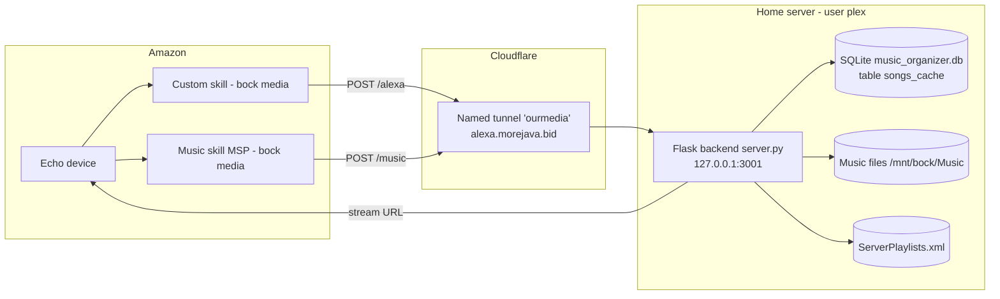

# ourMedia — Complete Setup Runbook ("Don't Lose It")

This is the authoritative, rebuild-from-scratch reference for the **working** ourMedia
Alexa setup as of 2026-05-30. If the box dies, this file + the backed-up secret files
(see [Backup checklist](#15-backup-checklist)) is everything needed to restore it.

> Secret *values* (client secrets, tokens, tunnel credentials) are **not** pasted here —
> they live in git-ignored files. This file documents their structure and exact location.

---

## 1. Architecture at a glance



Two Alexa skills share one backend and one tunnel:
- **Custom skill** (`/alexa`) — `"open bock media"`, `"ask bock media to ..."`. Fallback path.
- **Music skill / MSP** (`/music`) — `"play <playlist> on bock media"`. Native music provider; drives Now Playing.

---

## 2. Key identifiers (memorize / back up)

| Thing | Value |
|---|---|
| Custom skill ID | `amzn1.ask.skill.c13622d4-8780-4bea-93a5-0ded84307466` |
| Music (MSP) skill ID | `amzn1.ask.skill.5a3f1b96-1e0d-4a39-ac7a-1bacd6f4438a` |
| MSP catalog ID | `amzn1.ask-catalog.cat.8d881399-7f6b-4d02-93c9-6c4b44043406` |
| Catalog type / size | `AMAZON.MusicPlaylist`, 629 entities |
| Invocation name / alias | `bock media` |
| Public hostname | `alexa.morejava.bid` (fixed, never rotates) |
| Custom endpoint | `https://alexa.morejava.bid/alexa` |
| Music endpoint | `https://alexa.morejava.bid/music` |
| OAuth endpoints | `https://alexa.morejava.bid/oauth/authorize` + `/oauth/token` |
| Cloudflare tunnel name | `ourmedia` |
| Cloudflare tunnel UUID | `4916dffe-cfa6-4dde-ba2e-02b9306cc5b0` |
| Skill stage | `development` (testing kept alive via cron) |

---

## 3. Host paths & environment

| Path | Purpose |
|---|---|
| `/home/plex/Documents/github/ourMedia` | Repo / `WorkingDirectory` |
| `/home/plex/Documents/github/ourMedia/server.py` | Flask backend (entry point) |
| `/mnt/bock/Music/music_organizer.db` | SQLite DB (`DB_PATH`), table `songs_cache` |
| `/mnt/bock/Music` | `MUSIC_ROOT` — music files |
| `/home/plex/.bockmedia/ServerPlaylists.xml` | `DATA_DIR` — playlist source (~22 MB); `.bockmedia` is a symlink → `/home/plex/.MyMediaForAlexa` (the upstream indexer's data) |
| `/home/plex/.cloudflared/` | Tunnel config + credentials |

- Backend listens on **port 3001** (`Environment=PORT=3001`).
- Service runs as user/group **plex**, interpreter **`/usr/bin/python3`**.
- `ask` CLI: **v2.30.7** at `/home/linuxbrew/.linuxbrew/bin/ask`.

---

## 4. Backend (`server.py`)

### Key constants
```
HERE                  = repo dir
DB_PATH               = $OURMEDIA_DB_PATH    (default /mnt/bock/Music/music_organizer.db)
MUSIC_ROOT            = $OURMEDIA_MUSIC_ROOT  (default /mnt/bock/Music)
DATA_DIR              = $OURMEDIA_DATA_DIR    (default /home/plex/.bockmedia → symlink to indexer data; ServerPlaylists.xml)
EXPECTED_SKILL_APP_ID = amzn1.ask.skill.c13622d4-8780-4bea-93a5-0ded84307466
MSP_DEVICE_ID         = 'msp-bock-media'      (Now Playing pseudo-device)
MSP_DEVICE_NAME       = 'Bock Media (Alexa)'
```

> External data lives outside the repo and is **configurable via environment variables**
> (`OURMEDIA_DB_PATH`, `OURMEDIA_DATA_DIR`, `OURMEDIA_MUSIC_ROOT`). The code hardcodes nothing
> machine-specific; defaults preserve this deployment. The values are declared in
> `ourmedia.service`. Scripts honor the same vars (`scripts/playlist_audit.py`,
> `scripts/build_msp_catalog.py`, plus `OURMEDIA_PLAYLIST_DIR`).

### Runtime data files (in repo dir, all git-ignored)
`config.json`, `queues.json`, `devices.json`, `nowplaying_state.json`,
`streaming_history.jsonl`, `selected_state.json`, `ignored_tracks.json`,
plus logs `server.log`, `tunnel.log`, `cron-ask.log`, `msp_slu_poll.log`,
and `artwork_cache/`.

### HTTP routes
- Web console / static: `/`, `/<path:filename>`
- Library API: `/api/summary`, `/api/watchfolders`, `/api/playlists` (+`/rename`), `/api/artists`, `/api/albums`, `/api/songs`, `/api/recent`, `/api/analytics`
- Settings/config: `/api/settings` (GET/POST), `/api/config` (GET/POST), `/api/clearcache`
- Devices: `/api/devices`, `/api/devices/<id>` (POST/DELETE), `/api/devices/<id>/merge`, `/api/devices/merge_candidates`, `/api/devices/<id>/dismiss_candidate`
- Now Playing: `/api/nowplaying`, `/api/currenttrack`, `/api/nowplaying_devices`, `/api/selected`
- Media: `/stream/<path:filepath>`, `/artwork/<path:filepath>`
- OAuth (account linking): `/oauth/authorize` (GET/POST), `/oauth/token` (POST)
- Alexa: `/alexa` (custom skill), `/music` (MSP music skill)

### `/music` request shapes (important)
- **Directives** `{header, payload}` → `_msp_handle()`. Bearer in `Authorization` header
  OR `payload.requestContext.user.accessToken`.
- **Playback events** `{request, context}` (`AlexaAudioPlayQueueEvent.*`) → `_msp_handle_event()`.
  Bearer in `context.System.user.accessToken`. **MSP carries no device id** — all playback is
  attributed to pseudo-device `msp-bock-media` so the Now Playing UI works.

---

## 5. `config.json` (structure — secrets git-ignored)

Lives at repo root, **git-ignored**. Template: `config.example.json`.

```json
{
  "publicUrl": "https://alexa.morejava.bid",
  "launchPlaylistPrompt": true,
  "msp": {
    "skillId": "amzn1.ask.skill.5a3f1b96-1e0d-4a39-ac7a-1bacd6f4438a",
    "catalogId": "amzn1.ask-catalog.cat.8d881399-7f6b-4d02-93c9-6c4b44043406",
    "alias": "bock media",
    "endpoint": "https://alexa.morejava.bid/music"
  },
  "mspOauth": {
    "clientId": "<19 chars — SECRET>",
    "clientSecret": "<43 chars — SECRET>",
    "accessToken": "<43 chars — SECRET>",
    "refreshToken": "<43 chars — SECRET>",
    "redirectUriPrefixes": [
      "https://alexa.amazon.com/",
      "https://layla.amazon.com/",
      "https://pitangui.amazon.com/"
    ]
  }
}
```

- `mspOauth.accessToken` is the bearer the backend validates on every `/music` call.
- `launchPlaylistPrompt: true` → `"open bock media"` asks for a playlist and keeps the session open.
- `alexaRemote {url,email,password,otpSecret}` (optional) — Amazon creds for the "Play on device" feature (see §17).

---

## 17. "Play on device" — play a playlist on a specific Echo from the web UI ✅ WORKING

Amazon has **no official API** to start playback on a chosen Echo from a skill/MSP (playback is always device-initiated), so the `#playlists` ▶ button uses the **unofficial Alexa API** (`alexapy`, the lib Home Assistant uses). It injects a text command on the selected device = exactly like speaking *"ask bock media to start the &lt;name&gt; playlist"*, which runs our **custom skill** and plays the library directly.

### Moving parts
- **`alexa_remote.py`** — alexapy wrapper: cookie-session reuse (`make_login`/`_login_from_cookie`), `list_devices()`, `play_text(target, text)`. Per-call throwaway asyncio loop (Flask is sync). Pseudo-device shim exposes `_device_type`/`device_serial_number`/`_locale`.
- **`scripts/alexa_login.py`** — one-time auth, writes session to `<DATA_DIR>/.storage/alexa_media.<email>.pickle`. Modes: `--proxy` (used — browser login), `--cookies <file>` (insufficient — see below), bare (password form login).
- **Endpoints (`server.py`):** `GET /api/alexa_remote/status` (`{available,configured}`), `GET /api/alexa_remote/devices`, `POST /api/playlists/play` (`{id|name, device, shuffle}`).
- **Frontend:** per-row ▶ → device-picker modal (`openPlayMenu` in `public/js/app.js`); button shows only when `status.configured`.
- **Config:** `config.json` → `alexaRemote {url:"amazon.com", email, password, otpSecret}`.

### Exact working settings (2026-06-01)
- **Dependency (pinned):** `pip3 install --user alexapy "aiohttp>=3.10,<3.11"`. The pin is **mandatory** — alexapy 1.26.9 (last py3.10 build) imports `ALLOWED_CLOSE_CODES`, removed in aiohttp ≥3.11; without it `import alexapy` fails in `alexawebsocket`. Installed: alexapy 1.26.9, aiohttp 3.10.11. Service runs as `plex`, so `--user` is on its path.
- **Auth = browser proxy login** (account uses a **passkey**; the form-login script and cookie-import both fail — modern Amazon requires an OAuth token that's only minted during a real login/device-registration, which raw web cookies can't provide). A passkey was un-automatable, so a **password was added** to the Amazon account (passkey kept) and:
  ```bash
  /usr/bin/python3 scripts/alexa_login.py --proxy --host 192.168.1.187 --port 3005
  # open http://192.168.1.187:3005 in a browser on the LAN, sign in (choose
  # password if passkey is offered — passkeys are bound to amazon.com origin and
  # won't work through the proxy), land on "Successfully logged in…".
  ```
- **Command verbs (collision-safe):** non-shuffle → **`start`**, shuffle → **`mix`** (`server.py` `play_playlist_on_device`). NEVER `play`/`shuffle` — Amazon's music domain hijacks those + a music name and routes to the (now-disabled) MSP music skill / default provider.
- **Two Amazon-side changes were required to stop a "Link your Bock Media account" card** (playback worked underneath it, but the card was annoying):
  1. **Disabled the MSP music skill** so "bock media" is no longer a music provider:
     `ask smapi delete-skill-enablement --skill-id amzn1.ask.skill.5a3f1b96-1e0d-4a39-ac7a-1bacd6f4438a --stage development`
  2. **Removed the (vestigial, unused) account linking from the CUSTOM skill** (it was `IMPLICIT` → `https://alexa.morejava.bid/login`; the skill never used the token):
     `ask smapi delete-account-linking-info --skill-id amzn1.ask.skill.c13622d4-8780-4bea-93a5-0ded84307466 --stage development`
     (If a device still shows the card, toggle the skill off/on in the Alexa app to refresh cached metadata.)
  - Note: the 6-hourly enablement cron only re-enables the **custom** skill (`c13622d4…`), NOT the music skill — so MSP stays disabled. The nightly MSP catalog upload still runs but is harmless.

### Maintenance / gotchas
- **Cookies expire** → ▶ button fails with `not_authenticated`; re-run the `--proxy` login above and restart `ourmedia`.
- Unofficial API — can break on Amazon changes (no warning).
- Device list includes multi-room groups (e.g. "Downstairs") — useful — and Fire TVs, which may not handle the music command well.
- Re-enabling MSP later (to restore one-shot "play X on bock media") means re-fixing its account linking AND accepting the link-card collision returns unless handled.

---

## 6. Custom skill (`skill/`)

- **`interaction_model.json`** — `invocationName: "bock media"`. Intents:
  - `PlayPlaylistIntent` (slot `PlaylistName` = `AMAZON.SearchQuery`) — samples include play/queue/start/put on/load.
  - `ShufflePlaylistIntent` — samples include **mix**/**randomize** (avoid the word "shuffle" to dodge Spotify).
  - `PlayArtistIntent` and others (artist/album/genre).
- **`manifest.development.json`** — custom api, `AUDIO_PLAYER` interface, endpoint `https://alexa.morejava.bid/alexa`, name `Bock Media`.

### Deploy the interaction model (async — wait for SUCCEEDED)
```bash
PATH=/home/linuxbrew/.linuxbrew/bin:$PATH ask smapi set-interaction-model \
  -s amzn1.ask.skill.c13622d4-8780-4bea-93a5-0ded84307466 -g development -l en-US \
  --interaction-model "file:skill/interaction_model.json"
PATH=/home/linuxbrew/.linuxbrew/bin:$PATH ask smapi get-skill-status \
  --skill-id amzn1.ask.skill.c13622d4-8780-4bea-93a5-0ded84307466 --resource interactionModel
```

---

## 7. Music skill / MSP (`skill/music-manifest.json`)

- API `music`, endpoint `https://alexa.morejava.bid/music` (also set per-region NA and in `events.endpoint`).
- `aliases: [{ "name": "bock media" }]`, `promptName: "bock media"`.
- `features: [{ "name": "EXPLICIT_LANGUAGE_FILTER" }]` — required or Alexa blocks with
  "Explicit Filter is on, and bock media doesn't support filtering".
- Interfaces (must match `_msp_handle` in server.py):
  - `Alexa.Media.Search` → `GetPlayableContent`
  - `Alexa.Media.Playback` → `Initiate`
  - `Alexa.Media.PlayQueue` → `GetItem`, `SetShuffle`, `SetLoop`
  - `Alexa.Audio.PlayQueue` → `GetNextItem`, `GetPreviousItem`
- `events.subscriptions`: SKILL_ENABLED/DISABLED, SKILL_ACCOUNT_LINKED, AUDIO_ITEM_PLAYBACK_STARTED/FINISHED/STOPPED/FAILED.

### Update music manifest + re-enable
```bash
SK=amzn1.ask.skill.5a3f1b96-1e0d-4a39-ac7a-1bacd6f4438a
PATH=/home/linuxbrew/.linuxbrew/bin:$PATH ask smapi update-skill-manifest \
  -s $SK -g development --manifest "file:skill/music-manifest.json"
PATH=/home/linuxbrew/.linuxbrew/bin:$PATH ask smapi set-skill-enablement --skill-id $SK --stage development
```
> After any capability/feature/alias change, the user must **disable + re-enable** the skill
> in the Alexa app for devices to pick it up. The simulator updates instantly; devices cache.

---

## 8. Account linking (`skill/account-linking.json`)

**Git-ignored** (holds `clientSecret`). Template: `account-linking.example.json`.

```json
{
  "accountLinkingRequest": {
    "type": "AUTH_CODE",
    "authorizationUrl": "https://alexa.morejava.bid/oauth/authorize",
    "accessTokenUrl": "https://alexa.morejava.bid/oauth/token",
    "clientId": "ourmedia-msp-client",
    "clientSecret": "<43 chars — SECRET>",
    "accessTokenScheme": "HTTP_BASIC",
    "scopes": ["music"],
    "domains": [],
    "skipOnEnablement": false
  }
}
```

### Push account-linking config
```bash
SK=amzn1.ask.skill.5a3f1b96-1e0d-4a39-ac7a-1bacd6f4438a
PATH=/home/linuxbrew/.linuxbrew/bin:$PATH ask smapi update-account-linking-info \
  -s $SK -g development --account-linking-request "file:skill/account-linking.json"
```
User step: Alexa app → Skills → Your Skills → Bock Media → Settings → **Link Account**.

---

## 9. MSP catalog (playlists for voice resolution)

- Source: `$OURMEDIA_DATA_DIR/ServerPlaylists.xml` (i.e. `/home/plex/.bockmedia/...`) → generated `skill/catalog_playlists.json` (629 entities).
- Entity `id` == ServerPlaylists playlist ID; `entityId` from `GetPlayableContent` maps back via `_msp_playlist_by_id`.

```bash
SK=amzn1.ask.skill.5a3f1b96-1e0d-4a39-ac7a-1bacd6f4438a
CID=amzn1.ask-catalog.cat.8d881399-7f6b-4d02-93c9-6c4b44043406
python3 scripts/build_msp_catalog.py                       # regenerate skill/catalog_playlists.json
python3 scripts/upload_msp_catalog.py --catalog-id "$CID" --file skill/catalog_playlists.json
PATH=/home/linuxbrew/.linuxbrew/bin:$PATH ask smapi list-uploads-for-catalog -c "$CID"
```
> `SLU_MODELING` (voice model) can stay `PENDING` for hours/indefinitely on dev-stage music
> skills. Entity-resolution (simulator) works once `ER_INGESTION` succeeds; real-device voice
> one-shots depend on `SLU_MODELING`. Re-uploading **resets** the clock — don't spam it.
> Poll with `scripts/poll_msp_slu.py` (logs to `msp_slu_poll.log`).

---

## 10. Cloudflare named tunnel

`/home/plex/.cloudflared/config.yml`:
```yaml
tunnel: 4916dffe-cfa6-4dde-ba2e-02b9306cc5b0
credentials-file: /home/plex/.cloudflared/4916dffe-cfa6-4dde-ba2e-02b9306cc5b0.json

ingress:
  - hostname: alexa.morejava.bid
    service: http://127.0.0.1:3001
  - service: http_status:404
```
Directory also contains `cert.pem` and the tunnel credentials JSON. **Both are secret — back them up.**
Binary: `/usr/local/bin/cloudflared`. Latency to `alexa.morejava.bid` should be <500 ms (>2 s → Alexa times out).

---

## 11. systemd services

All in `/etc/systemd/system/`, run as user **plex**.

- **`ourmedia.service`** — Flask backend. `ExecStart=/usr/bin/python3 .../server.py`, `Restart=always`, logs → `server.log`. Environment: `PORT=3001`, `OURMEDIA_DB_PATH`, `OURMEDIA_DATA_DIR`, `OURMEDIA_MUSIC_ROOT` (external data locations — change these to relocate). After editing this unit in the repo, copy to `/etc/systemd/system/`, `daemon-reload`, restart.
- **`ourmedia-tunnel-named.service`** — `cloudflared tunnel --config .../config.yml run ourmedia`. `Requires=ourmedia.service`, `Restart=always`, logs → `tunnel.log`.
- **`ourmedia-stack.target`** — boot aggregate, `WantedBy=multi-user.target`, wants both services above.

```bash
sudo systemctl restart ourmedia
sudo systemctl restart ourmedia-tunnel-named
systemctl is-active ourmedia ourmedia-tunnel-named ourmedia-stack.target
sudo systemctl daemon-reload          # after editing unit files
sudo systemctl enable ourmedia-stack.target
```

---

## 12. Cron jobs (this project)

```cron
# Keep development skill-testing enabled (lapses on its own ~hours)
0 */6 * * * PATH=/home/linuxbrew/.linuxbrew/bin:/usr/bin:/bin /home/linuxbrew/.linuxbrew/bin/ask \
  smapi set-skill-enablement --skill-id amzn1.ask.skill.c13622d4-8780-4bea-93a5-0ded84307466 \
  >> /home/plex/Documents/github/ourMedia/cron-ask.log 2>&1
```
> First thing to try if the skill suddenly routes to Spotify/Amazon again: re-run that command.
> (The crontab also contains unrelated Plex/Spotify music-automation jobs — out of scope here.)

---

## 13. What works (voice + routines)

- **Routines (most reliable)** — trigger phrase → action **Music → bock media → "<playlist>"**.
  Bypasses NLU arbitration entirely; 100% reliable.
- **MSP voice**: `"Alexa, play <playlist> on bock media"` (needs `SLU_MODELING` done + account linked).
- **Custom skill**: `"open bock media"` (LaunchRequest), `"ask bock media to mix <playlist>"`.
- Prefer **mix / randomize** over **shuffle / play** to avoid Amazon/Spotify grabbing the phrase.
- Real Echo > simulator. Simulator can't test MSP `simulate-skill` and lacks default-music-provider arbitration.

---

## 14. Disaster-recovery rebuild order

1. Restore repo + restore git-ignored secret files (§15).
2. Restore the data dir and recreate the symlink: `ln -sfn /home/plex/.MyMediaForAlexa /home/plex/.bockmedia` (or point `OURMEDIA_DATA_DIR` wherever `ServerPlaylists.xml` lives); ensure DB at `/mnt/bock/Music/music_organizer.db`.
3. Restore `/home/plex/.cloudflared/` (config.yml + creds JSON + cert.pem). Install `cloudflared`.
4. Install the 3 systemd units → `daemon-reload` → `enable ourmedia-stack.target` → `start`.
5. Verify: `curl -s -o /dev/null -w "%{http_code}\n" http://127.0.0.1:3001/api/summary` (200) and
   `curl -I https://alexa.morejava.bid/alexa` via tunnel.
6. Re-push skill artifacts if needed: interaction model (§6), music manifest (§7), account linking (§8), catalog (§9).
7. Re-enable testing (§12) and re-link the account in the Alexa app.

---

## 15. Backup checklist (CRITICAL — these are NOT in git)

Back these up off-box; without them the above identifiers are not enough:

- [ ] `config.json` (mspOauth client id/secret + access/refresh tokens)
- [ ] `skill/account-linking.json` (OAuth clientSecret)
- [ ] `/home/plex/.cloudflared/config.yml`
- [ ] `/home/plex/.cloudflared/4916dffe-cfa6-4dde-ba2e-02b9306cc5b0.json` (tunnel creds)
- [ ] `/home/plex/.cloudflared/cert.pem`
- [ ] `/home/plex/.MyMediaForAlexa/ServerPlaylists.xml` (playlist source of truth; reached via the `~/.bockmedia` symlink)
- [ ] `/mnt/bock/Music/music_organizer.db` (or the means to rebuild it)
- [ ] The 3 systemd unit files (also tracked: `ourmedia.service`, `ourmedia-stack.target` in repo)
- [ ] Amazon developer account credentials + `ask configure` profile (`~/.ask/`)

> Everything else (skill IDs, catalog ID, tunnel UUID, endpoints, manifests, scripts) is in this
> repo / this file and safe in git.

---

## 16. Quick diagnostics

```bash
# Is Alexa reaching us?
grep -E "POST /alexa|POST /music|\[ALEXA\]|\[MSP" server.log | tail -20
# Stack health
systemctl is-active ourmedia ourmedia-tunnel-named
# End-to-end latency (<2 s)
curl -o /dev/null -s -w "total=%{time_total}s\n" https://alexa.morejava.bid/alexa -X POST -H "Content-Type: application/json" -d '{}'
# MSP playback events / Now Playing
grep "MSP EVENT" server.log | tail
curl -s "http://127.0.0.1:3001/api/nowplaying_devices"
```

See also `.cursor/rules/alexa-skill-troubleshooting.mdc` for the full issue/fix history.

---

## 18. Library metadata pipeline (`songs_cache` enrichment)

The external **music_organizer** indexer is the primary writer of `songs_cache`,
but it derives some columns from the folder layout rather than the files' own
tags. Confirmed on this library: **album** is stored as `"[YEAR] Folder Name"`
(differs from the real album for ~90% of audio), **album_artist** is empty for
**100%** of rows, and **track_number / disc_number** are largely unset. Title and
artist are well populated.

Maintenance scripts read embedded tags (mutagen) and treat the file's own tags as
authoritative, keeping `songs_cache` and the files in sync. All tag logic lives in
one place: [`scripts/lib/tag_io.py`](scripts/lib/tag_io.py) (read/write + normalization
+ shared SQLite lock handling). `backfill_genres.py` also reads through it.

```bash
# 1. Audit (read-only). DB coverage is instant; the tag pass samples files.
python3 scripts/audit_metadata.py --no-tags          # coverage + case-duplicate report
python3 scripts/audit_metadata.py --sample 20000     # + tag-vs-DB drift on a sample
python3 scripts/audit_metadata.py --json             # machine-readable

# 2. Backfill. ALWAYS dry-run first; it reads every audio file (hours on ~400k).
python3 scripts/backfill_metadata.py --dry-run --limit 5000      # pilot
python3 scripts/backfill_metadata.py                            # realign DB + files on diff
python3 scripts/backfill_metadata.py --no-write-files           # DB only, leave files alone
python3 scripts/backfill_metadata.py --only-missing             # fast: only fill empty fields
python3 scripts/backfill_metadata.py --fields album,album_artist
python3 scripts/backfill_metadata.py --overwrite-artist         # opt-in: tags override artist too

# Genre/year/duration (unchanged, still useful):
python3 scripts/backfill_genres.py
python3 scripts/backfill_duration.py
```

### Behavior & safety

- **Tags win, but never blank a field.** A column changes only when the file has a
  non-empty tag value that differs from the DB. Empty tags are ignored.
- **`artist` is fill-only by default.** The indexed artist is clean and fully
  populated; raw artist tags are often multi-value (`A/B`, `feat.`) and can't be
  split safely (`AC/DC`). Use `--overwrite-artist` only after reviewing the audit.
- **Files are modified in place.** `mutagen` rewrites tags (it does **not**
  re-encode audio). **Back up the library before the first full run.** Use
  `--no-write-files` to update only the DB.
- **`title`** has any leading track-number prefix (`"01 - "`) stripped;
  `--strip-remaster` additionally drops trailing `(Remastered…)` on title/album.

### Ordering vs the indexer (IMPORTANT)

`music_organizer` is the upstream writer; if it re-scans after a backfill it can
**overwrite** these columns back to the folder-derived values. Run backfills
**after** the indexer's scan, or pause/disable the indexer's metadata write while
validating. Long-term, schedule the backfills (cron) to run after the indexer and
treat them as the source of truth for `album` / `album_artist` / track numbers.
`server.py` re-queries `songs_cache` per request, so corrected metadata appears in
the web UI, Now Playing, and Alexa speech with no restart.

---

## 19. Picard (MusicBrainz) — tag the ~11% gap

Files with **no embedded tags** cannot be fixed by `backfill_*.py`. Use
[MusicBrainz Picard](https://picard.musicbrainz.org/) to write tags to disk, then
sync into the DB.

```bash
python3 scripts/picard_queue.py              # ~/.bockmedia/picard-queue-dirs.tsv
# Picard GUI: load folders from TSV → Cluster → Lookup → Save (see docs/PICARD.md)
./scripts/after_picard.sh                    # genres + album_artist/track → songs_cache
```

Full walkthrough: [`docs/PICARD.md`](docs/PICARD.md). Album stays `[YEAR] …` in the DB;
Picard tags files; `after_picard.sh` uses `--no-write-files` for metadata backfill.
