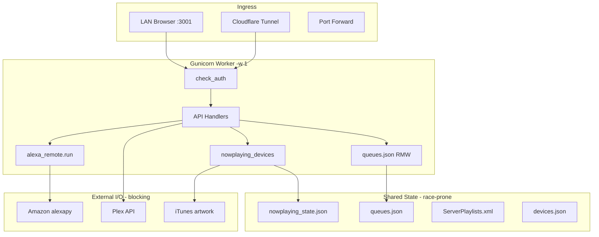

# Bock Media — Comprehensive Bug Hunt Report

**Date:** 2026-06-11  
**Scope:** Full-stack audit — Flask backend, Alexa custom skill + MSP, Plex sync, web UI, Android app, systemd ops, tests, security  
**Branch state:** Working tree with extensive uncommitted changes vs `main` (+4388/−2466 lines across ~40 files)  
**Production config:** gunicorn `-w 1`, `OURMEDIA_DATA_DIR=/home/plex/.bockmedia`, Cloudflare tunnel `alexa.morejava.bid`

---

## Executive Summary

This audit spun **four parallel investigation layers** (backend, frontend, tests/ops, Android/security) and verified critical findings against live code and test runs.

| Category | Count |
|----------|-------|
| **Critical** | 6 |
| **High** | 22 |
| **Medium** | 45+ |
| **Low** | 30+ |
| **Tests failing** | 3 / 153 |
| **Tests passing** | 150 / 153 |

**Top production risks today:**

1. **Open LAN API** when `WebPassword` is unset — any device on Wi‑Fi can trigger Alexa playback, change settings, rewrite config.
2. **Unsigned media on LAN** — `/stream/` and `/artwork/` skip HMAC for private IPs; full library enumerable without auth.
3. **Ghost Now Playing rows** — stopped playback can remain visible up to 10 minutes (confirmed by 3 failing tests).
4. **Health watchdog path split** — cron writes `REPO/health_state.json`; server reads `~/.bockmedia/health_state.json` → dashboard always “degraded”.
5. **Queue lock ordering deadlock** — inverted `fcntl` + threading lock order can wedge the single gunicorn worker.
6. **Service worker stale JS** — precaches `app.js?v=23` while HTML loads `app.js?v=25`.

Recent session fixes (artwork 403, Amazon probe wedging, Plex health timeout) addressed symptoms but several structural issues remain.

---

## Methodology

### Layers investigated

| Layer | Files / systems | Technique |
|-------|-----------------|-----------|
| **L1 Backend core** | `server.py`, `alexa_remote.py`, `plex_client.py`, `catalog_cache.py`, `playlist_xml_lock.py` | Static analysis, lock-order tracing, auth flow mapping |
| **L2 Integrations** | `scripts/sync_plex_playlists.py`, MSP `/music`, OAuth, Alexa `/alexa` | Handler review, XML sync atomicity |
| **L3 Web frontend** | `public/js/app.js`, `public/index.html`, `public/sw.js` | Hot-path tracing, poll/tick analysis, XSS review |
| **L4 Android** | `android/app/src/main/kotlin/...` | Credential storage, interceptor behavior, network config |
| **L5 Ops** | `ourmedia.service`, `ourmedia-health.service`, `scripts/health_check.py`, `requirements.txt` | Path/config drift, deploy bootstrap |
| **L6 Tests** | `tests/*.py`, `conftest.py` | Full pytest run, coverage gap mapping (~85 routes) |
| **L7 Security** | Auth matrix (LAN / tunnel / external), stream signatures, secrets in repo | Threat modeling, header-trust analysis |

### Verification performed

- `pytest tests/` → **150 passed, 3 failed** (21s)
- Confirmed `scripts/health_check.py` writes `REPO/health_state.json` vs `server.py` `DATA_DIR/health_state.json`
- Confirmed SW precache `app.js?v=23` vs HTML `app.js?v=25`
- Confirmed `nowplaying_devices()` 600s grace fallback at `server.py:6082–6084`
- Confirmed queue lock inversion: `_load_queues` (flock→thread) vs `_store_queue` (thread→flock)
- Artwork path fix (`_media_url_to_path`) verified separately — music-relative URLs now resolve under `MUSIC_ROOT`

---

## Test Results

```
153 tests total
150 passed
3 failed
```

| Test | Failure |
|------|---------|
| `test_alexa.py::TestAudioPlayerEvents::test_stopped_marks_not_playing` | Stopped device still in `/api/nowplaying_devices` |
| `test_alexa.py::TestAudioPlayerEvents::test_finished_marks_not_playing` | Same |
| `test_regressions.py::TestStuckNowPlaying::test_playback_stopped_does_not_set_paused` | Idle row visible after `PlaybackStopped` |

**Root cause (all three):**

```python
# server.py:6082–6084
recent = bool(st.get('timestamp') and (time.time() - st['timestamp']) < 600)
active = st.get('playing') or st.get('paused') or (
    recent and st.get('filepath') and st.get('token'))
```

`PlaybackStopped` clears `playing` but retains `filepath` + `token`. The 10-minute grace window (added for optimistic NP during automation fan-out) conflicts with tests and user expectation that stopped = gone.

---

## Critical Findings

### C-01 — Open LAN API when no WebPassword

| | |
|---|---|
| **File** | `server.py:371–422`, mutating routes throughout |
| **Impact** | Unauthenticated LAN clients can POST to `/api/playlists/play`, `/api/settings`, `/api/config`, automations, device control |
| **Repro** | Default install, empty `WebPassword` → `curl -X POST http://192.168.x.x:3001/api/playlists/play -d '{"device":"…","name":"Daily Music"}'` |
| **Fix** | Default-deny API; require Basic auth or `mobileApi` token for all mutating routes; opt-in `allowOpenLanApi` |

### C-02 — Unsigned stream/artwork on LAN (library exfiltration)

| | |
|---|---|
| **File** | `server.py:4168–4172`, `4202–4207`, `check_auth:405–406` |
| **Impact** | Any LAN client can GET `/stream/<path-under-MUSIC_ROOT>` and `/artwork/...` without signature |
| **Repro** | `curl http://192.168.1.187:3001/stream/plexDB/Artist/album/track.mp3` → 200 |
| **Fix** | Require HMAC signatures everywhere except loopback; or require auth header on all media paths |

### C-03 — Stream auth bypass via forged Cloudflare headers

| | |
|---|---|
| **File** | `server.py:180–196`, `_verify_stream_access`, `_is_tunnel_request` |
| **Impact** | Port-forwarded `:3001` + forged `Host: alexa.morejava.bid` + `Cf-Connecting-Ip: 192.168.x.x` → signature check skipped |
| **Repro** | External reachability + spoofed CF headers → unsigned stream access |
| **Fix** | Never trust `Cf-*` unless connection truly from Cloudflare; bind `:3001` LAN-only; always require HMAC on external |

### C-04 — Queue lock ordering deadlock

| | |
|---|---|
| **File** | `server.py:4350–4376` |
| **Impact** | Thread A holds `_QUEUES_LOCK`, waits for `flock`; Thread B holds `flock`, waits for `_QUEUES_LOCK` → worker wedged |
| **Repro** | Concurrent `PlaybackNearlyFinished` (decode_token) + `start_playing` (_store_queue) on same worker |
| **Fix** | Uniform lock order: always `flock` before `_QUEUES_LOCK`; hold flock across full read-modify-write |

### C-05 — queues.json RMW not atomic across processes

| | |
|---|---|
| **File** | `server.py:4374–4500` |
| **Impact** | `flock` released between load and save; with `-w 2+` last writer wins, queue entries vanish |
| **Fix** | Hold exclusive flock for entire RMW in `_store_queue`, `_update_queue_flags`, `_set_queue_stop` |
| **Mitigation today** | gunicorn `-w 1` reduces but does not eliminate race with cron/CLI |

### C-06 — Ghost Now Playing after stop (test-confirmed)

| | |
|---|---|
| **File** | `server.py:6082–6084`, `6075–6077` |
| **Impact** | Stopped tracks show in UI up to 10 min; GET `/api/nowplaying_devices` writes NP file on every poll |
| **Fix** | Remove or narrow grace (require `playing:true` optimistic flag with TTL); clear token on stop; don't write NP on read-only GET |

---

## High Severity Findings

### Backend

| ID | File | Issue | Fix |
|----|------|-------|-----|
| H-B01 | `server.py:5788–5963` | `nowplaying_state.json` — threading lock only, no flock; concurrent Alexa events + UI poll lose rows | Add flock; skip write on GET unless changed |
| H-B02 | `server.py:6676+`, `sync_plex_playlists.py` | `ServerPlaylists.xml` read without `playlist_xml_lock`; sync uses non-atomic `tree.write` | Shared lock on reads; atomic write (tmp + replace) |
| H-B03 | `sync_plex_playlists.py:301–306` | State file saved before XML — crash → stale cache, skipped re-fetch | Write XML first, then state |
| H-B04 | `server.py:1325–1354` | `_PLAY_FILE_TOKENS` in-memory only — restart loses file-play tokens | Persist like playlist tokens |
| H-B05 | `server.py:6558–6642` | OAuth endpoints open on LAN without WebPassword | Require admin auth; tunnel-only OAuth |
| H-B06 | `server.py:4350–4357` | Bare `except:` on queue/NP JSON load → silent `{}` on corruption | Log, backup, fail closed |
| H-B07 | `server.py:2278–2295` | Automation scheduler starts per worker import — `-w 2+` duplicates fires | File lock leader election or systemd timer |
| H-B08 | `server.py:6705–6734` | MSP `track_metadata()` hits iTunes (4s) on hot path — Alexa timeout | Use `track_metadata_fast()` for MSP |
| H-B09 | `alexa_remote.py:203–208` | `run()` blocks worker up to 20s — play/volume endpoints wedge server | Background executor; return 503 if busy |
| H-B10 | `server.py:1713–1773` | Play-intent correlation can mis-bind Echo to wrong room | Require serial match; shorten TTL |

### Frontend

| ID | File | Issue | Fix |
|----|------|-------|-----|
| H-F01 | `public/sw.js:2` vs `index.html:78` | SW precaches `app.js?v=23`, HTML loads `v=25` | Single version constant; align precache |
| H-F02 | `public/sw.js:24–34` | Stale-first shell caching — users keep old JS after deploy | Network-first for `app.js`; bump cache version |
| H-F03 | `public/js/app.js:1038–1045` | NP poll clears UI on API error (`_npItems = []`) | Keep last good snapshot on `isApiError` |
| H-F04 | `public/js/app.js:1041` vs `1489` | Poll shows controls without `remote.configured` check | Unify gating logic |
| H-F05 | `public/js/app.js:1038–1045` | Full card `outerHTML` rebuild every 5s — resets sliders/focus | Patch in place (times/progress only) |
| H-F06 | `public/js/app.js:188–195` | Artwork falls back to unsigned URL → 403 off-LAN | Never unsigned fallback; refetch signed URL |
| H-F07 | `public/js/app.js:2439–2440` | Every play-on-device calls `probe=1` — Amazon login hammer | Use cached auth unless stale |
| H-F08 | `public/js/app.js:25–30` | Basic creds in `localStorage` plaintext | Session cookie or secure storage only |
| H-F09 | `public/js/app.js:64–68` | `API()` auth errors treated as empty data across loaders | Uniform error handling |

### Ops / Deploy

| ID | File | Issue | Fix |
|----|------|-------|-----|
| H-O01 | `scripts/health_check.py:26` vs `server.py:46` | Watchdog writes `REPO/health_state.json`; server reads `DATA_DIR/health_state.json` | Point both to `DATA_DIR` |
| H-O02 | `scripts/health_check.py` | Reads `REPO/config.json` not `DATA_DIR/config.json` | Use `OURMEDIA_DATA_DIR` |
| H-O03 | Git history | `devices.json` committed with real Echo IDs, room names | `git filter-repo`; add to `.gitignore` |
| H-O04 | `requirements.txt` | Untracked; missing `alexapy`, pinned `aiohttp` | Track file; add alexapy stack |
| H-O05 | Working tree | Large uncommitted `server.py` diff — prod may diverge from git | Commit or tag deploy snapshots |

### Android / Security

| ID | File | Issue | Fix |
|----|------|-------|-----|
| H-A01 | `build.gradle.kts` | Secrets in `BuildConfig` (token, password defaults) | Empty defaults; setup-only entry |
| H-A02 | `SecureCredentialStore.kt` | Plaintext fallback if encryption fails | Fail hard, force re-login |
| H-A03 | `AndroidManifest.xml` | `allowBackup="true"` — credential extraction | `allowBackup="false"` |
| H-A04 | `network_security_config.xml` | Cleartext HTTP permitted globally | HTTPS-only external; restrict LAN |
| H-A05 | `config.example.json` | `allowExternalAccess` defaults true | Default false |
| H-A06 | `AuthInterceptor.kt` | Sends creds to LAN hosts contrary to Setup UI copy | Match docs or restrict headers |
| H-A07 | `alexa_remote.py` | Login proxy binds LAN IP — session capture risk | Bind 127.0.0.1 only |

---

## Medium Severity Findings (selected)

### Backend concurrency & state

- **M-B01** Automation `lastFiredAt` set after fire completes — duplicate fires same minute if Amazon slow
- **M-B02** `play_tokens.json` RMW — threading lock only, no flock
- **M-B03** `streaming_history.jsonl` append — no cross-process lock
- **M-B04** Device merge `_migrate_state_files` — wrong keys for queue migration (dead code)
- **M-B05** `_append_m3u_track` substring false positive on paths
- **M-B06** Playlist create accepts paths outside `MUSIC_ROOT`
- **M-B07** Stale in-process playlist caches after Plex sync
- **M-B08** `catalog_cache` sidecar invalidation by exact mtime only
- **M-B09** `plex_client.track_ratingkey_for_path` — basename collision in Plex search
- **M-B10** MSP `ItemPlaybackStopped` may clear NP on token mismatch edge cases

### Frontend UX & correctness

- **M-F01** Overlapping NP poll requests (no in-flight guard)
- **M-F02** Analytics doesn't handle `isApiError`; charts not destroyed on navigate away
- **M-F03** Rooms poll silently clears grid on error
- **M-F04** Play buttons use `configured` not `authenticated`
- **M-F05** Automation edit — device dropdown race with groups load
- **M-F06** Pagination not clamped when data shrinks (except playlist detail)
- **M-F07** Settings/automation `probe=1` on every page open
- **M-F08** Duplicate `/api/nowplaying_devices` traffic (NP poll + header bar)

### Test coverage gaps

- **M-T01** No tests for `/music` MSP handlers
- **M-T02** No OAuth `/oauth/*` tests
- **M-T03** Stream signature auth untested (only 404 paths)
- **M-T04** Play-on-device / `alexa_remote.play_text` not integration-tested
- **M-T05** Automations, device merge, rooms, smart/AI playlists — ~30 routes zero coverage
- **M-T06** Mobile API Bearer gate untested
- **M-T07** Alexa tests bypass signature verification (`post_alexa` fixture)
- **M-T08** `conftest.py` hard-binds prod paths — not CI-portable

### Security (medium)

- **M-S01** Tunnel detection trusts client-supplied CF headers
- **M-S02** `/api/auth/info` leaks username
- **M-S03** Play file tokens 8 hex chars (~32 bits) — brute-forceable on open LAN
- **M-S04** No rate limiting on auth/OAuth endpoints
- **M-S05** `mobileApi` token comparison not constant-time

---

## Low Severity Findings (selected)

| Area | Issue |
|------|-------|
| Backend | `is_authenticated()` returns `False` (not unknown) when probe lock busy |
| Backend | Alexa login proxy listens on all interfaces during login window |
| Backend | Plex sync orphan `.m3u` files on crash mid-loop |
| Frontend | Font Awesome CDN not in SW precache — offline icons missing |
| Frontend | Chart.js CDN without SRI |
| Frontend | `onclick` attributes in HTML strings — safe today, fragile pattern |
| Frontend | Login URL in `href` — needs `javascript:` blocklist |
| Ops | `ourmedia.service` gitignored — unit drift across hosts |
| Ops | Gunicorn `-w 1` correct for now but multi-worker breakage untested |
| Android | Lock screen shows track info (`VISIBILITY_PUBLIC`) |
| Android | DEBUG HTTP logging interceptor risk |
| Android | 30s endpoint URL cache without 401 invalidation |

---

## Auth & Network Matrix

```
┌─────────────────┬──────────────────┬─────────────────┬──────────────────┐
│ Request source  │ /api/*           │ /stream /artwork│ /alexa /music    │
├─────────────────┼──────────────────┼─────────────────┼──────────────────┤
│ LAN, no password│ OPEN (C-01)      │ UNSIGNED (C-02) │ Handler auth     │
│ LAN + password  │ Basic or token   │ UNSIGNED        │ Handler auth     │
│ External :3001  │ Token/Basic      │ Auth or sig     │ BLOCKED          │
│ CF tunnel       │ Token/Basic*     │ Sig or auth**   │ OPEN at edge     │
│ Spoofed CF+Host │ Varies (C-03)    │ Sig bypass risk │ Varies           │
└─────────────────┴──────────────────┴─────────────────┴──────────────────┘
* unless allowTunnelApi
** cache paths need auth without valid sig on tunnel
```

---

## Architecture Hot Paths (where bugs cluster)



**Wedging pattern (observed in production):** sync worker blocked on `alexa_remote.run()` (Amazon login, 20s+) while health cron, UI polls, and automations queue behind it. Mitigations applied: probe lock, `-w 1`, delayed auth refresh, Plex 2s timeout. Structural fix: never block worker on Amazon for read paths.

---

## Fixes Already Applied (this branch, pre-audit session)

| Fix | File | Status |
|-----|------|--------|
| Artwork 403 — `_media_url_to_path()` | `server.py` | ✅ Verified |
| LAN client artwork URLs (`for_client=True`) | `server.py`, `app.js` | ✅ |
| Amazon probe lock + timeout | `alexa_remote.py` | ✅ Partial |
| gunicorn `-w 1` | `ourmedia.service` | ✅ Deployed |
| Auth refresh delayed 45s | `alexa_remote.py` | ✅ |
| Plex health 2s timeout | `plex_client.py` | ✅ |
| NP optimistic write, queue flock | `server.py` | ✅ Partial (deadlock remains) |
| Automation page probe=0 | `app.js` | ✅ |
| `init()` restored | `app.js` | ✅ |

---

## Remediation Roadmap

### Phase 0 — Immediate (hours)

1. Fix health watchdog path → `DATA_DIR/health_state.json` in `scripts/health_check.py`
2. Align SW precache with `app.js?v=25` (or bump to v26 together)
3. Resolve NP grace vs tests — clear token on `PlaybackStopped` or drop 600s fallback for `playing:false`
4. Fix queue lock ordering (single order: flock → thread → RMW → unlock)

### Phase 1 — Security (days)

1. Default-require auth on all `/api/*` mutating routes
2. Require stream signatures on LAN (or Basic/token on every media GET)
3. Fix CF header trust — bind `:3001` LAN-only or validate tunnel origin
4. Add `devices.json` to `.gitignore`; scrub git history
5. Track complete `requirements.txt`

### Phase 2 — Reliability (week)

1. flock on `nowplaying_state.json`; stop writing on read-only GET
2. `playlist_xml_lock` on all XML reads; atomic sync writes
3. Persist file play tokens; flock on `play_tokens.json`
4. Automation scheduler single-leader
5. Frontend: NP poll error retention, unified control gating, reduce probe=1

### Phase 3 — Coverage (ongoing)

1. Fix 3 failing NP tests as regression gate
2. Add MSP `/music` handler tests
3. Add stream signature tests
4. Add OAuth smoke tests
5. CI-friendly `conftest.py` (no prod path hard-bind)

---

## Appendix A — File Inventory Touched by Audit

```
server.py                 — 7800+ lines; core backend
alexa_remote.py           — Amazon unofficial API wrapper
plex_client.py            — Plex two-way sync
catalog_cache.py          — Playlist sidecar index
playlist_xml_lock.py      — XML shared/exclusive lock
scripts/sync_plex_playlists.py
scripts/health_check.py
public/js/app.js          — 4900+ lines; SPA
public/index.html
public/sw.js
ourmedia.service
ourmedia-health.service
requirements.txt
android/app/...           — Kotlin mobile client
tests/test_alexa.py
tests/test_regressions.py
tests/test_api.py
tests/conftest.py
```

---

## Appendix B — Failing Test Details

```python
# tests/test_alexa.py — after PlaybackStopped event:
np = client.get('/api/nowplaying_devices').get_json()['items']
assert len(np) == 0  # FAILS: item still present

# tests/test_regressions.py — same assertion after stop
visible = [x for x in np if x['deviceId'] == device_id]
assert len(visible) == 0  # FAILS
```

To reproduce manually:
1. Start playback on registered device (Alexa `PlaybackStarted`)
2. Send `PlaybackStopped` or `AMAZON.StopIntent`
3. GET `/api/nowplaying_devices` within 10 minutes
4. Observe row still present with track metadata

---

## Appendix C — Related Documentation

- `.cursor/rules/alexa-skill-troubleshooting.mdc` — Alexa skill ops, Spotify collision, MSP notes
- `docs/PICARD.md` — Picard integration (separate concern)
- `config.example.json` — reference for security-sensitive flags

---

## Appendix D — Audit Agent References

Multi-layer hunt performed via parallel code exploration:

- Backend: queue locks, auth, sync, MSP, NP state
- Frontend: polls, artwork, SW cache, Alexa probes
- Tests/Ops: pytest run, health path, requirements, coverage map
- Android/Security: credential storage, auth matrix, LAN exposure

---

---

# Second Pass — Deeper & Wider (2026-06-11, same day)

The first pass was **not** exhaustive. A second sweep targeted (a) areas the first pass skipped — `scripts/`, skill JSON configs, `catalog_cache.py`, `playlist_xml_lock.py`, the full Alexa intent dispatcher, the DB layer, Android UI screens/widgets, and deeper web-UI routes — and (b) the fixes applied *this session* (most likely place for fresh regressions).

A pre-existing **`BUG_REPORT.md`** (60 items, dated 2026-06-10, IDs `AND-*`, `SRV-*`, `WEB-*`) was also discovered. The findings below are **new relative to both** that report and the first pass of this document. Verified spot-checks: `alexa_skill()` has no top-level try/except (confirmed line 6991); `BUG_REPORT.md` overlap excluded.

**Second-pass new findings: ~58.**

---

## NEW Critical / High

### NP-C1 — `/alexa` dispatcher has no top-level exception guard ⭐ VERIFIED

| | |
|---|---|
| **File** | `server.py:6991` (`alexa_skill`), contrast `/music` at `6967–6970` |
| **Impact** | Any uncaught exception in any intent handler → Flask **HTTP 500**, not Alexa JSON → Echo says *"The requested skill did not provide a valid response"* |
| **Why it matters** | This is the exact symptom in `.cursor/rules/alexa-skill-troubleshooting.mdc`. Many handlers (`int()` on slots, smart-rule parse, OS errors) can throw. |
| **Fix** | Wrap intent/event dispatch in try/except → return `alexa_speak(...)` + log, mirroring `/music` |

### NP-H1 — Plex sync has no inter-run lock (docs claim one exists)

| | |
|---|---|
| **File** | `scripts/sync_plex_playlists.py` entry; `.cursor/rules` references `/tmp/plex_playlist_sync.lock` |
| **Impact** | Full re-pull (~100s) overlaps the next `*/5` cron → duplicate Plex load, duplicate `.bak`, exclusive-lock contention |
| **Fix** | Non-blocking flock at script start; exit if already running |

### NP-H2 — Maintenance scripts read/write `ServerPlaylists.xml` without the lock

| | |
|---|---|
| **Files** | `scripts/build_msp_catalog.py:49–90`, `prune_unplayable.py:31–163`, `playlist_audit.py:166–342`, `check_playlist_playability.py:50–64` |
| **Impact** | Nightly catalog build / manual `--fix` runs overlap the 5-min sync's non-atomic `tree.write()` → torn XML, lost `<Entry>` rows, bad MSP catalog uploaded to Alexa |
| **Fix** | `playlist_xml_lock(shared=True)` on reads; atomic tmp+replace on writes |

### NP-H3 — `sync_alexa_public_url.py` only updates the custom skill endpoint

| | |
|---|---|
| **File** | `scripts/sync_alexa_public_url.py:141–167` |
| **Impact** | Host/tunnel migration leaves MSP `/music` manifest + OAuth account-linking URLs pointing at the old host → MSP + account linking silently break |
| **Fix** | Also update `music-manifest.json` and `account-linking.json` endpoints, or document as custom-only |

### NP-H4 — `playlist_xml_lock()` defaults to EXCLUSIVE

| | |
|---|---|
| **File** | `playlist_xml_lock.py:12–18` — `exclusive or not shared` is True when both default False |
| **Impact** | Any future caller that omits `shared=True` expecting concurrent reads serializes all playlist access or deadlocks with writers |
| **Fix** | Require explicit `shared=`/`exclusive=`, or default to `LOCK_SH` |

### NP-H5 (Android) — PlayLauncher clears play request before Alexa status loads

| | |
|---|---|
| **File** | `android/.../ui/components/PlayLauncher.kt:50–54` |
| **Impact** | Tapping ▶ right after app open (remote status still loading) shows "Configure Alexa…" and drops the request; user must tap twice |
| **Fix** | Distinguish "status loading" from "confirmed unavailable"; don't clear target until status resolves |

### NP-H6 (Android) — `duration_seconds` DTO mismatch

| | |
|---|---|
| **File** | `android/.../data/api/dto/ApiDtos.kt:225–232, 276–278` |
| **Impact** | `PlaylistTrack.duration` / `SongItem.duration` never populate — server sends `duration_seconds`. All track durations show null/0 |
| **Fix** | `@SerialName("duration_seconds")` |

### NP-H7 (Android) — MainActivity blank startup + `recreate()` on deep link

| | |
|---|---|
| **File** | `MainActivity.kt:94–95` (blank composable while `hasServer == null`), `115–118` (`onNewIntent` → `recreate()`) |
| **Impact** | Cold start shows blank screen; widget/notification deep link restarts the whole activity, losing nav stack and form input |
| **Fix** | Show loading state; route via `mutableStateOf` instead of `recreate()` |

### NP-H8 (Web) — `renderDevices()` has no route guard

| | |
|---|---|
| **File** | `public/js/app.js:2831–2897` + ~10 callers |
| **Impact** | Async device action (test clip 11s refresh, rename, merge, identify) completing after navigation repaints the Devices page over whatever route the user moved to |
| **Fix** | `if (currentRoute !== 'devices') return;` (mirror `renderAutomation`) |

### NP-H9 (Web) — HTTP 207 partial play treated as full success

| | |
|---|---|
| **File** | `public/js/app.js:2487–2495`, `978–993`; server returns 207 + `{ok:false, errors}` at `server.py:1836` |
| **Impact** | Group play where one Echo fails → toast claims success on all N; modal closes |
| **Fix** | Check `data.ok === false` / `data.errors.length` after `res.ok`; show partial-failure toast |

---

## NEW Medium — Backend / Alexa logic

| ID | File | Issue |
|----|------|-------|
| NP-M1 | `server.py:7735–7746`, `4420–4437` | `ShuffleOnIntent` is a **no-op for lazy queues** — writes `tracks` that `_resolve_queue_tracks` ignores; never sets `shuffle_seed` |
| NP-M2 | `server.py:6318–6332` | `SkipIntent`/`NextIntent`/`NextCommandIssued` **bypass stop-after-N and time sleep timer** (only `PlaybackNearlyFinished` enforces) |
| NP-M3 | `server.py:7660–7674` | `IgnoreSongIntent` skip also bypasses sleep/stop-after limits |
| NP-M4 | `server.py:7571–7577` | `PlayCurrentIntent` for playlists uses inline `start_playing` → **300-track cap** (Daily Music ~1954 truncated) |
| NP-M5 | `server.py:7433–7436`, `5666` | `PlayTrackIntent` queues **up to 50 fuzzy matches** for one song request |
| NP-M6 | `server.py:1039–1045` | `/api/search` collects playlists in XML order until limit **then** sorts → best matches beyond N dropped |
| NP-M7 | `server.py:4521–4526` | `decode_token` materializes tracks **outside** `_QUEUES_LOCK` (TOCTOU with prune/update) |
| NP-M8 | `server.py:5607`, `7476`, `1476` | Duplicate album names → `_album_tracks_for_play` merges multiple artists' "Greatest Hits" |
| NP-M9 | `server.py:6367`, `4458` | `StopAfterIntent` speech says "N more songs" but counts current song (off-by-one wording) |
| NP-M10 | `catalog_cache.py:62–71` | Summary cache 60s TTL, not invalidated on XML/DB change → stale dashboard counts |
| NP-M11 | `catalog_cache.py:78–107` | `rebuild_playlists_index_from_xml` parses XML with no lock / no error handling |
| NP-M12 | `scripts/upload_msp_catalog.py:38–70` | `urlopen` uncaught; null ETag → opaque SMAPI failure on catalog upload |
| NP-M13 | `scripts/alexa_login.py:84–97` | Proxy login success path doesn't `stop_proxy_login()` → port 3005 conflict on repeat |
| NP-M14 | `scripts/sync_alexa_public_url.py:34–42` | `config.json` written non-atomically |
| NP-M15 | logs (`cron-catalog.log`, `plex-sync.log`, `msp_slu_poll.log`) | No rotation anywhere → unbounded growth, disk-full risk |

## NEW Medium — Android

| ID | File | Issue |
|----|------|-------|
| NP-A1 | `media/NowPlayingMonitorService.kt:78–83` | MediaSession position = static `offset_ms` → lock-screen/Bluetooth seek bar frozen |
| NP-A2 | `ui/dashboard/DashboardScreen.kt:39–60` | Single `runCatching` batch — `health()` failure after `summary()` success shows no error |
| NP-A3 | `ui/automation/AutomationScreen.kt:43–55` | `load()` has no `.onFailure` / error state |
| NP-A4 | `ui/nowplaying/NowPlayingScreen.kt:138–141` | Alexa devices fetched once; transient failure permanently disables controls |
| NP-A5 | `widget/NowPlayingSessionStore.kt:57–74` | Optimistic skip vs `fetchAndStore` race (no Mutex) |
| NP-A6 | `widget/NowPlayingController.kt:102–124` | Each skip spawns a new poll `Thread` → overlapping polls |
| NP-A7 | all screens | No `rememberSaveable` → search/page/form state lost on rotation |
| NP-A8 | `ui/navigation/Routes.kt:50` | `playlistDetailRoute(id)` not URL-encoded → IDs with `/` `%` break NavHost |
| NP-A9 | `ui/navigation/BockNavGraph.kt:232` | `currentRoute()` `substringBefore("/")` → nested routes don't highlight drawer |

## NEW Medium/Low — Web (beyond BUG_REPORT WEB-*)

| ID | File | Issue |
|----|------|-------|
| NP-W1 | `public/js/app.js:885–940` | `loadRooms()` no `routeAlive` guard after awaits |
| NP-W2 | `public/js/app.js:1335–1336` | Sleep-timer modal copy wrong for minute options ("end of current song") |
| NP-W3 | `public/js/app.js:3774–3826` | Most Settings toggles don't auto-save; only `launchPlaylistPrompt` has onchange → silent loss |
| NP-W4 | `public/js/app.js:3724` | `runAutomationNow` ignores `result.errors` partial failures |
| NP-W5 | `public/js/app.js:3901` | `saveAllSettings()` no in-flight guard → double-submit |
| NP-W6 | `public/css/style.css:767` | Mobile `sidebar-open` disables hamburger toggle (can't close via ☰) |
| NP-W7 | `public/js/app.js:854` | `loadPlaybackCard()` is dead code |

---

## NEW Low / Config

| ID | File | Issue |
|----|------|-------|
| NP-L1 | `skill/account-linking.json:7` | Live OAuth `clientSecret` present in repo tree (gitignored but on disk) |
| NP-L2 | `server.py:4755`, `4807` | Playlist rename orphans old name-based `.m3u` files |
| NP-L3 | `server.py:610`, `catalog_cache.py:78` | `rename_playlist` invalidates in-memory cache but not sidecar index |
| NP-L4 | `server.py:7623`, `4702` | `AddToPlaylistIntent` appends m3u but not XML `TrackCount` |
| NP-L5 | `server.py:5280`, `5031` | Smart-playlist `int()` on rule values & `playlist_detail` page/limit unguarded → 500 |
| NP-L6 | `server.py:2699`, `3089` | `_resolve_device_id` 4-hop cap returns wrong primary on long/corrupt alias chains |
| NP-L7 | `scripts/build_msp_catalog.py:60` | Duplicate playlist IDs silently skipped (no warning) |
| NP-L8 | `scripts/backfill_duration.py:45` | Opens DB RW without retry wrapper → "database is locked" abort |
| NP-L9 | `skill/manifest.development.json` | Stale placeholder manifest diverges from production — wrong-file upload risk |
| NP-A10 | `ApiDtos.kt` | `/api/rooms controlsAvailable`, `/api/search genres`, `SmartPlaylist linkedPlaylistId` DTO gaps |

---

## Self-review of THIS session's fixes

The code changed earlier today was re-examined for introduced bugs:

| Change | Verdict |
|--------|---------|
| `_media_url_to_path()` + `serve_artwork` rewrite | ✅ Correct — music-relative URLs resolve under `MUSIC_ROOT`; traversal still bounded by allowed-roots check |
| `_amazon_probe_slot` flock + `run()`/`run_coro()` split | ⚠️ `run()` raises `AlexaRemoteError('probe_busy')` if lock held >0 — callers on request path (volume/control) must handle this code or users see errors; **lock-order with queue flock not unified** (deadlock C-04 still open) |
| Auth refresh thread `time.sleep(45)` startup delay | ✅ Reasonable; reduces boot-time Amazon hammer |
| `is_authenticated` returns `False` (not `None`) when probe slot busy | ⚠️ Matches first-pass low finding — UI can flash "not authenticated" during a concurrent probe |
| gunicorn `-w 1` | ✅ Mitigates multi-worker races but **masks** them — they remain latent if scaled |
| `plex_client.status(timeout=2)` | ✅ Correct fix for health wedge |

**Net:** session fixes are sound for the reported symptoms; they do **not** resolve the structural locking (C-04/C-05), open-LAN auth (C-01/C-02), or NP-grace test failures (C-06).

---

## Is the hunt now exhaustive?

**Closer, but no audit is ever provably complete.** Coverage after two passes:

| Layer | Coverage |
|-------|----------|
| Backend core (auth, streams, queues, NP) | High |
| Alexa intent dispatcher (all intents) | High |
| MSP `/music` + OAuth | High |
| DB layer / SQL injection | High (no injection found — params + whitelisted ORDER BY) |
| `scripts/` + cron interplay | High |
| Skill JSON configs | High |
| Web UI (all routes) | High |
| Android UI + widgets + DTOs | High |
| Ops / systemd / health | High |
| **Runtime/load behavior** | **Low — not exercised** (no concurrency stress, no fuzzing, no real-device Alexa test) |
| **Third-party (alexapy, Cloudflare) failure modes** | **Low** |

### Remaining ways to find more (require runtime, out of scope for static read)

1. **Concurrency stress test** — hammer `/api/nowplaying_devices` + simulated Alexa events to trigger the lock races live
2. **Alexa simulator / real Echo** — exercise every intent for the unhandled-500 path (NP-C1)
3. **`-w 2` soak** — surface all the in-memory-state and scheduler-duplication bugs
4. **Fuzz** slot values, token strings, malformed JSON to `/alexa` and `/music`
5. **DB-locked injection** — run a scan during sync to hit the "database is locked" paths

*End of report. No code was modified as part of this documentation pass.*
