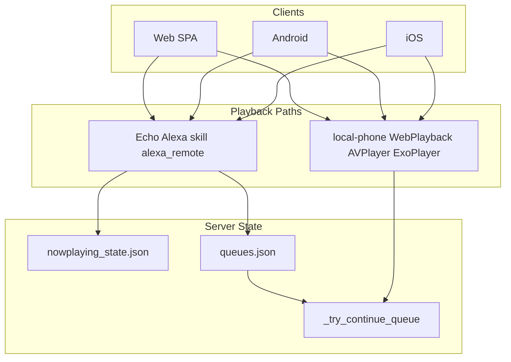

# Bock Media — Comprehensive Bug Hunt Report

**Date:** 2026-06-27  
**Branch/commit:** `main` @ `0242ded`  
**pytest:** 303 passed, 48 skipped, 0 failed (11.21s)  
**Scope:** Full-stack adversarial audit — Flask backend, Alexa custom skill + MSP, web SPA, Android, iOS  
**Prompt used:** [`docs/BUG_HUNT_PROMPT.md`](BUG_HUNT_PROMPT.md)

---

## Executive Summary

Four parallel layer investigations (backend/Alexa, web, Android, iOS) plus cross-cutting playback matrix synthesis. **103 structured findings** (8 Critical, 28 High, 47 Medium, 20 Low/Polish).

| Severity | Count |
|----------|-------|
| Critical | 8 |
| High | 28 |
| Medium | 47 |
| Low / Polish | 20 |

### Top 5 production risks

1. **SRV-04 / A-08** — `_np_skip_next` wraps with `% len(tracks)` at queue end; non-looping queues restart at track 0; stop-after-N can be bypassed at boundary (A-09).
2. **WEB-B2-01** — Starting Alexa playback does not stop WebPlayback; player bar and queue can show wrong source while Echo plays.
3. **AND-C-01 / AND-02** — Notification artwork sync does synchronous HTTP on main thread via widget publish path → ANR risk.
4. **A-28 / ALEXA-NP-C1** — `/alexa` intent dispatch has no top-level try/except; handler exceptions → HTTP 500 → Echo "skill did not provide a valid response".
5. **A-01** — LAN GET `/api/*` still readable without auth when `WebPassword` unset (POST is default-deny; GET enumeration remains).

Many items from the 2026-06-11 hunt are **fixed** (C-02/C-03/C-04/C-06, NP flock, queue locks, stop-after on skip, security s18 tests). Several **regressions or partial fixes** remain.

---

## Methodology

| Layer | Files / systems | Technique |
|-------|-----------------|-----------|
| **A — Backend** | `server.py`, `bock_routes.py`, `alexa_remote.py`, `skill/` | Static analysis, lock-order tracing, intent handler review, prior doc re-verification |
| **B — Web** | `public/js/app.js`, `webPlayback.js`, `clientPrefsSync.js`, `sw.js`, `index.html` | Dual-mode player tracing, poll/tick analysis, SW version check |
| **C — Android** | `android/app/src/main/kotlin/...` | Composable control flow, DTO parity, AND-xx re-verification |
| **D — iOS** | `ios/BockMedia/...` | ViewModel poll, LocalPlaybackController, parity vs Android |
| **Tests** | `tests/*.py` | Full `pytest tests/ -v` run |

**Verification performed:**
- `pytest tests/` → 303 passed, 48 skipped (DB/XML fixtures absent locally)
- Confirmed `server.py:10745` modulo wrap in `_np_skip_next`
- Confirmed no `WebPlayback.stop()` on Alexa play path in `app.js`
- Confirmed `sw.js` precaches `app.js?v=25` vs `index.html` loads `?v=64`

---

## Cross-Platform Playback Matrix

### Skip (next / previous)

| Context | Expected | Actual / Bug |
|---------|----------|--------------|
| Echo voice | SkipIntent → `_np_skip_next`, stop at end if !loop | **BUG A-08:** wraps to track 0 via `% len(tracks)` |
| Echo remote | alexa_remote speaks → skill, no optimistic skip | **Fixed** — no double-skip in REST path |
| Echo stop-after-N on skip | Block at boundary | **Fixed** NP-M2 — `_np_queue_limit_reached` in skip path; **BUG A-09** wrap can still bypass at last track |
| Echo PlaybackFailed | Honor stop-after | **BUG A-22:** auto-advances without limit check |
| Android local | Prev restart if >3s; continue at end | OK; **D-10:** iOS skip at last wraps instead of continue |
| iOS local | Same as Android | **D-10:** `(index+1) % count` wraps on last track |
| Web browser | webPlayback.js respects shuffle order | OK |
| MSP GetNextItem | loop + isQueueFinished | OK; **A-16:** no `_try_continue_queue` at MSP end |

### Shuffle

| Context | Web | Android | iOS | Echo |
|---------|-----|---------|-----|------|
| At play start | ✓ picker + body | ✓ DevicePicker | ✓ DevicePicker | ✓ ShuffleXIntent |
| Mid-play toggle | ✓ Alexa bar | ✓ NP controls | **✗ missing D-01** | ✓ ShuffleOn/Off |
| State from server | Client `_npShuffle` only **B2-05** | Client map only **C-04** | N/A | Queue flag in `queues.json` |
| ShuffleArtist token path | N/A | N/A | N/A | **BUG A-13:** no `shuffle=True` |
| Mid-play lazy queue | N/A | N/A | N/A | **BUG A-12:** no `shuffle_seed` on ShuffleOnIntent |
| Local double-shuffle | N/A | **BUG C-09:** resolver + ExoPlayer | OK | N/A |

### Queue / Up Next

| Field | Web | Android | iOS | Echo |
|-------|-----|---------|-----|------|
| `upcoming` display | ✓ | ✓ | ✓ | Server queue |
| `upNext` room requests | Alexa mode only **B2-07** | ✓ | ✓ | Spliced at boundary **A-27 fixed** |
| Queue jump | Display-only | Local only; Alexa snackbar **C-12** | Disabled, no feedback **D-04** | Not supported |
| Reorder race | **B2-20** stale snapshot | Same API | Same API | Server-side OK |

### Extended Play (Continue After Queue)

| Mode | Server Echo | Android local | iOS local | Web browser |
|------|-------------|---------------|-----------|-------------|
| off | Stops at end | Stops | Stops | Stops **B2-04** |
| artist_radio / similar | `_try_continue_queue` | `tryContinueQueue` **C-02 ANR** | `tryContinuePlayback` **D-06/D-07 stale target** | **Not implemented B2-04/B2-18** |
| Per-member pref | **A-17:** XML only, ignores client_prefs | ClientPrefsSync | **D-12:** reads UserDefaults bypass | ClientPrefsSync **B2-16** off not pushed |
| MSP path | **A-16:** no continue | N/A | N/A | N/A |

---

## Findings by Severity

### Critical

| ID | Platform | File:Line | Issue | Repro | Fix |
|----|----------|-----------|-------|-------|-----|
| C-01 | Android | `NowPlayingNotificationManager.kt:172-189`, `NowPlayingWidget.kt:38-47` | Sync HTTP artwork on main looper → ANR | Widget refresh while Alexa playing | Async artwork fetch |
| C-02 | Android | `LocalPlaybackService.kt:537-554,615-670` | `tryContinueQueue()` uses `runBlocking` on playback thread | Continue-after-queue on slow network at playlist end | IO coroutine scope |
| C-03 | Android | `LocalPlaybackService.kt:421,146-158` | `runBlocking` in `onStartCommand` / ExoPlayer recovery | Tap notification play after process kill | Suspend off main |
| WEB-B2-01 | Web | `app.js:2016-2021,3725-3811` | Alexa play doesn't stop WebPlayback; bar shows wrong source | Play here → Play on speaker | Call `WebPlayback.stop()` before Alexa play |
| A-08 | Server | `server.py:10745` | Skip wraps non-looping queue to track 0 | Last track → "next" → plays track 1 | Use `idx+1`; stop if `>= len` && !loop |
| A-09 | Server | `server.py:10745-10748` | Modulo wrap bypasses stop-after-N at last track | stop-after-3 on track 3, skip → track 0 plays | Remove wrap before limit check |
| A-28 | Alexa | `server.py:11446-12263` | No try/except on `/alexa` intent dispatch | Bad slot → int() throw → 500 | Wrap like `/music:11437-11442` |
| A-22 | Alexa | `server.py:11583-11604` | PlaybackFailed auto-advances ignoring stop-after-N | Corrupt stream with stop-after armed | Check `_np_queue_limit_reached` first |

### High

| ID | Platform | File:Line | Issue | Repro | Fix |
|----|----------|-----------|-------|-------|-----|
| A-01 | Server | `server.py:899-914` | LAN GET `/api/*` open without auth | `curl /api/summary` on LAN | Default-deny all `/api/*` |
| A-04 | Server | `server.py:11016-11093` | OAuth endpoints unauthenticated | GET `/oauth/authorize` from LAN | Admin auth gate |
| A-13 | Alexa | `server.py:11773-11775` | ShuffleArtistIntent token path missing shuffle=True | "Shuffle X" → token playlist plays in order | Pass shuffle=True |
| A-16 | MSP | `server.py:11266-11276` | MSP GetNextItem never calls `_try_continue_queue` | MSP + continueAfterQueue=similar → stops | Invoke continue before isQueueFinished |
| A-31 | Server | `alexa_remote.py:108-118,277-279` | `run()` blocks Flask worker 10-20s | Concurrent remote play + API | Background executor |
| WEB-B2-09 | Web | `app.js:2128` | NP poll clears UI on API error | Brief `/nowplaying_devices` failure | Keep last good snapshot |
| WEB-B2-12 | Web | `sw.js:3` vs `index.html:165` | SW precaches app.js?v=25, HTML loads v=64 | SW install → stale shell | Shared version constant |
| WEB-B2-05 | Web | `app.js:2092-2096,2386-2397` | `_npShuffle` client-only, never from server | Reload → shuffle icon wrong | Seed from NP payload |
| WEB-B2-16 | Web | `clientPrefsSync.js:283-284` | continueAfterQueue `'off'` not pushed to server | Web off, mobile still similar | Always push explicit value |
| WEB-B2-28 | Web | `app.js:172-183` | Unsigned artwork before sign completes → 403 | mediaAuthRequired + cold NP load | Placeholder until signed |
| WEB-B2-20 | Web | `app.js:1857-1872` | Room reorder uses stale upNext snapshot | Two tabs reorder → corrupt order | GET fresh queue before POST |
| D-01 | iOS | `NowPlayingView.swift:553-618` | No shuffle toggle in Now Playing | Android has shuffle button | Add shuffle control |
| D-02 | iOS | `LocalPlaybackController.swift` | No setShuffle / remote shuffle_on/off | Cannot toggle shuffle mid-play | Implement like Android |
| D-06 | iOS | `LocalPlaybackController.swift:103-117,222` | Stale `activePlayTarget` breaks continue seed | Play A → discovery mix → continue uses A | Set target on playTracks |
| D-07 | iOS | `BockMediaRepository.swift:679-687` | Discovery play skips analyticsRepository | Fresh app → continue never runs | Set analytics on discovery play |
| D-12 | iOS | `LocalPlaybackController.swift:220` | Reads UserDefaults not AppPreferences | Refactor breaks continue mode | Single prefs source |
| C-04 | Android | `ApiDtos.kt:170-188`, `NowPlayingScreen.kt:111` | Remote shuffle never seeded on poll | Return to NP after shuffled Alexa play | Add shuffle to DTO + server NP |
| C-06 | Android | `NowPlayingScreen.kt` | No loop/repeat for Alexa (web has it) | Loop set on web, invisible on Android | Add loop transport |
| AND-03 | Android | `MainActivity.kt:132-155` | Failed connection test still enters app | Dead server URL → all screens error | Set hasServer=false on failure |
| AND-02 | Android | `NowPlayingNotificationManager.kt` | Main-thread HTTP in notification sync | Same as C-01 | Async artwork |

### Medium (selected — full list in layer reports)

| ID | Platform | Issue |
|----|----------|-------|
| A-12 | Alexa | ShuffleOnIntent mid-play missing shuffle_seed on lazy queues |
| A-15 | MSP | SetShuffle non-deterministic without persisted seed |
| A-17 | Server | `_try_continue_queue` ignores per-member client_prefs |
| A-21 | Server | `_expire_stale_playing` display-only; file still playing:true |
| A-23 | Server | queues.json flock released between load/save in _store_queue |
| A-29 | MSP | No dedicated MSP handler test suite (M-T01) |
| A-32 | Server | alexa_remote login proxy binds 0.0.0.0 |
| WEB-B2-02 | Web | Now Playing page shows Alexa card while WebPlayback active |
| WEB-B2-08 | Web | Overlapping NP polls, no in-flight guard |
| WEB-B2-10 | Web | outerHTML rebuild every poll resets sliders |
| WEB-B2-18/04 | Web | Browser playback ignores continueAfterQueue |
| WEB-B2-19 | Web | Family approve doesn't refresh queue panel |
| WEB-B2-22 | Web | Analytics API failure shows empty state |
| WEB-B2-31 | Web | actionBtn onclick quoting breaks paths with `"` |
| C-05 | Android | canControlDevice true without serial match |
| C-07 | Android | Mini bar missing shuffle |
| C-08 | Android | Driving mode local-only |
| C-09 | Android | Double shuffle in resolver + ExoPlayer |
| C-10 | Android | Up Next tap rebuilds entire ExoPlayer queue |
| C-11 | Android | Duplicate 5s pollers (architectural debt) |
| C-21 | Android | tryContinueQueue resets shuffle permutation |
| D-04 | iOS | Alexa Up Next disabled with no user feedback |
| D-09 | iOS | tryContinuePlayback errors swallowed |
| D-10 | iOS | skipNext wraps at last track instead of continue |
| D-15 | iOS | Widget rapid taps overwrite pendingControl |
| D-18 | iOS | Mini bar hardcodes remoteOk=true |
| D-22 | iOS | remoteOk stale 30s after Alexa auth failure |

### Low / Polish (selected)

| ID | Platform | Issue |
|----|----------|-------|
| A-25 | Server | `_store_queue_lazy` dead code, never called |
| A-35 | Alexa | Stop-after speech off-by-one wording |
| WEB-B2-14 | Web | SW exists but never registered |
| WEB-B2-27 | Web | invalidateAlexaRemoteStatus doesn't clear _alexaDevices |
| AND-12 | Android | No POST_NOTIFICATIONS check |
| AND-19 | Android | SearchField icon contentDescription null |
| D-05 | iOS | Up Next shows all tracks vs Android cap 15 |
| D-19 | iOS | playbackHandoff API unused in UI |
| D-20 | iOS | AlexaRemoteStatus missing portReady field |

---

## Platform Parity Gaps

| Feature | Web | Android | iOS | Echo |
|---------|-----|---------|-----|------|
| Mid-play shuffle toggle | Alexa bar ✓ | NP ✓ | **✗** | voice/remote ✓ |
| Loop/repeat | Alexa bar ✓ | **✗** | **✗** | voice ✓ |
| Mini bar shuffle | ✓ | **✗** | **✗** | N/A |
| Driving mode remote | N/A | **✗ local only** | **✗ local only** | N/A |
| Up Next queue jump | display-only | local ✓ / Alexa snackbar | disabled silent | N/A |
| continueAfterQueue (browser) | **✗** | local ✓ | local ✓ | server ✓ |
| continueAfterQueue (MSP) | N/A | N/A | N/A | **✗ A-16** |
| Handoff UI | **✗** | **✗** | **✗** | API exists |
| Seek/progress scrub | web ✓ | local ✓ | local ✓ | **✗** |
| Sleep timer UI | Alexa ✓ | Alexa ✓ | Alexa ✓ | voice ✓ |
| Shared NP poller | N/A | **✗ duplicate** | ✓ NowPlayingPollService | N/A |

---

## Endpoint Coverage Gaps

| Route group | Test coverage | Gap ID |
|-------------|---------------|--------|
| `POST /music` MSP (Initiate, GetItem, events) | Partial (room splice only) | M-T01 |
| `POST /oauth/*` | None | M-T02 |
| Stream HMAC auth paths | Partial (`test_security_s18`) | M-T03 |
| `alexa_remote.play_text` integration | None | M-T04 |
| `POST /api/playback/handoff` | None | M-T05 |
| `GET /api/continue` | None | M-T06 |
| `/api/analytics/export` | None | M-T07 |
| Smart playlist refresh_all | None | M-T08 |
| Device discover/identify | None | M-T09 |
| Mix-muse / acquire suggest | Partial | M-T10 |

**303 tests pass** but 48 skip locally due to missing `songs_cache` DB and `ServerPlaylists.xml` — integration coverage for real library paths is thin in CI/dev.

---

## Re-verified Prior Findings

| Original ID | Status | Notes |
|-------------|--------|-------|
| C-01 Open LAN API | **Partial** | POST default-deny; GET still open (A-01) |
| C-02 Unsigned LAN streams | **Fixed** | `test_security_s18.py` |
| C-03 Forged CF headers | **Fixed** | Loopback check on CF trust |
| C-04 Queue lock deadlock | **Fixed** | Uniform lock order |
| C-05 queues.json RMW | **Partial** | flock gap in _store_queue (A-23) |
| C-06 Ghost NP after stop | **Fixed** | stopped flag + 3min window |
| H-B01 NP flock | **Fixed** | cross-process flock |
| H-O01 Health path split | **Fixed** | DATA_DIR aligned |
| NP-M2 Stop-after on skip | **Fixed** | tests pass |
| SRV-04 Skip wraps at end | **Open** | A-08 confirmed `10745` |
| SRV-03 ShuffleArtistIntent | **Open** | A-13 token path |
| NP-C1 /alexa try/except | **Open** | A-28 |
| H-F01 SW version drift | **Reopened worse** | v25 vs v64 |
| H-F03 NP error clears UI | **Open** | B2-09 |
| AND-01 compile error | **Fixed** | load() zero-arg |
| AND-02 notification ANR | **Open** | C-01 |
| AND-03 dead server startup | **Open** | |
| AND-05 shuffle DTO | **Open partial** | server also omits shuffle in NP |
| AND-06 dayOfWeek | **Fixed** | DayCount DTO |
| AND-07 playlist pagination | **Fixed** | infinite scroll |
| AND-11 serial fallback | **Fixed** | skips no-serial devices |
| WEB-01 actionBtn quoting | **Open** | B2-31 |

---

## Recommended Test Additions (Top 20)

1. `_np_skip_next` at last track with loop=false → stops, does not wrap
2. `_np_skip_next` at stopAfterIdx boundary → does not play track 0
3. `PlaybackFailed` with stop-after-N armed → does not advance
4. `ShuffleArtistIntent` with UI token → shuffle=True applied
5. MSP `GetNextItem` at queue end with continueAfterQueue=similar → appends tracks
6. `/alexa` intent handler exception → returns valid Alexa response, not 500
7. `POST /api/alexa_remote/play` while WebPlayback active (E2E web — manual)
8. NP poll API failure → client retains last snapshot (web unit)
9. Room queue reorder with concurrent approve (integration)
10. `continueAfterQueue` per-member pref vs household XML resolution
11. `AMAZON.ShuffleOnIntent` on lazy queue → deterministic order with seed
12. `client_prefs` push `'off'` for continueAfterQueue round-trip
13. OAuth `/authorize` requires auth when WebPassword set
14. MSP Initiate timeout with large playlist (mock)
15. `tryContinueQueue` Android — mock network, assert no main-thread block
16. iOS `tryContinuePlayback` with stale activePlayTarget → wrong seed detection
17. iOS skipNext at last track → calls continue not wrap
18. Remote control double-skip regression (existing — keep in CI)
19. Room request splice in both AudioPlayer and MSP paths (partial exists)
20. Full `/music` handler suite: Initiate, GetNextItem, SetShuffle, ItemPlaybackStopped

---

## Triage: Critical / High — Fix Order

| Priority | ID | Effort | Impact |
|----------|-----|--------|--------|
| 1 | A-08, A-09 | S | Correct skip/stop-at-end on Echo |
| 2 | WEB-B2-01 | S | Stop lying player bar |
| 3 | C-01, C-02, C-03 | M | Android ANR at playback boundaries |
| 4 | A-28, A-22 | S | Alexa skill reliability |
| 5 | WEB-B2-09, WEB-B2-12 | S | Web stability after deploy/auth blips |
| 6 | D-01, D-02, D-06, D-07, D-12 | M | iOS shuffle + continue correctness |
| 7 | A-01 | M | LAN data exposure |
| 8 | C-04, WEB-B2-05 | M | Shuffle state truth across clients |
| 9 | WEB-B2-04, B2-18 | M | Web browser extended play |
| 10 | A-16 | M | MSP extended play parity |

---

## Appendix: Playback Architecture

---

## Appendix: Key File Index

| Area | Path |
|------|------|
| Server core | `server.py`, `bock_routes.py`, `alexa_remote.py` |
| Alexa model | `skill/interaction_model.json` |
| Web shell | `public/js/app.js`, `public/js/webPlayback.js` |
| Android NP | `android/.../ui/nowplaying/NowPlayingScreen.kt` |
| Android local | `android/.../media/LocalPlaybackService.kt` |
| iOS NP | `ios/BockMedia/Features/NowPlaying/NowPlayingView.swift` |
| iOS local | `ios/BockMedia/Media/LocalPlaybackController.swift` |
| Tests | `tests/test_alexa.py`, `tests/test_regressions.py`, `tests/test_security_s18.py` |
| Prior hunt | `docs/COMPREHENSIVE_BUG_HUNT.md` |
| Reusable prompt | `docs/BUG_HUNT_PROMPT.md` |

---

*End of report. 103 findings across 4 layers. Re-run after fixes with `docs/BUG_HUNT_PROMPT.md`.*
