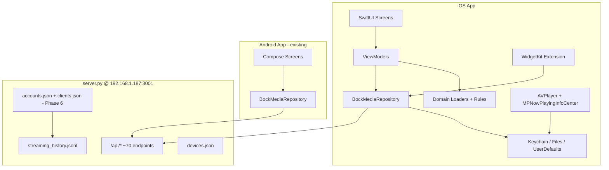
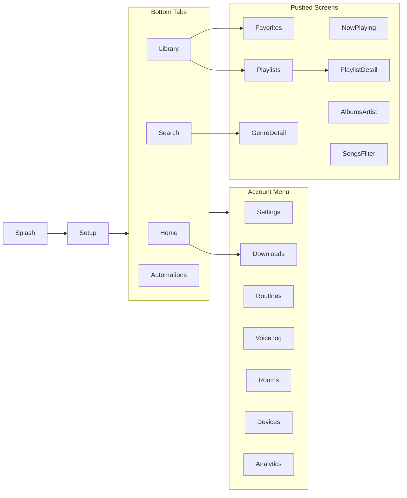
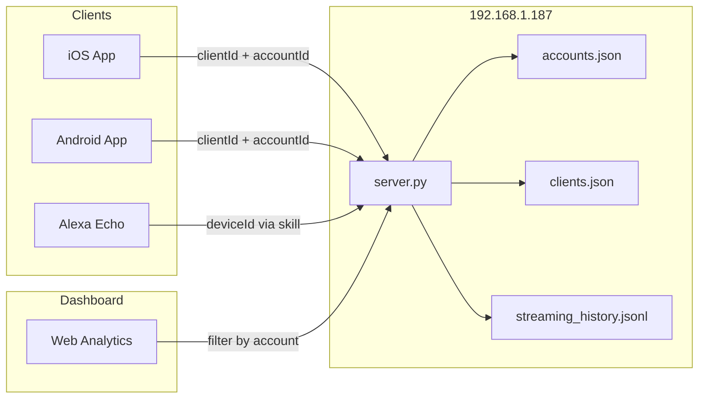

# iOS Bock Media — Complete Build Plan

Native iOS client with **full feature and UI parity** with the Android app (`android/`, ~99 Kotlin files, Jetpack Compose), plus a **forward-looking design** for per-device accounts and cross-platform analytics on the `192.168.1.187` dashboard.

---

## Table of contents

1. [Goals and constraints](#1-goals-and-constraints)
2. [Recommended architecture](#2-recommended-architecture)
3. [Feature parity matrix](#3-feature-parity-matrix)
4. [Phase 0 — Foundation](#4-phase-0--foundation-week-12)
5. [Phase 1 — Core playback and browse](#5-phase-1--core-playback-and-browse-week-36)
6. [Phase 2 — Now Playing and Alexa control](#6-phase-2--now-playing-and-alexa-control-week-79)
7. [Phase 3 — Local playback and offline](#7-phase-3--local-playback-and-offline-week-1014)
8. [Phase 4 — Admin, analytics, polish](#8-phase-4--admin-analytics-polish-week-1518)
9. [Phase 5 — Widget and background](#9-phase-5--widget-and-background-week-1921)
10. [Phase 6 — Accounts and per-device analytics](#10-phase-6--accounts-and-per-device-analytics-future)
11. [UI parity checklist](#11-ui-parity-checklist)
12. [Testing strategy](#12-testing-strategy)
13. [Personal deployment](#13-personal-deployment-no-paid-apple-developer)
14. [Repo and CI](#14-repo-and-ci)
15. [Timeline estimate](#15-timeline-estimate)
16. [Risks and mitigations](#16-risks-and-mitigations)
17. [Recommended first sprint](#17-recommended-first-sprint)
18. [Summary](#18-summary)

---

## 1. Goals and constraints

| Goal | Notes |
|------|--------|
| Feature parity | Every Android screen, flow, and capability |
| UI parity | Same dark Spotify-style layout, colors, navigation, mini bar |
| Personal use | Sideload via free Apple ID; no App Store |
| Future accounts | Each phone/tablet/Echo gets an identity; analytics per account on dashboard |

### Hard constraints

- **Mac + Xcode required** — no cross-compile from Linux/Windows
- **No shared UI code today** — Android is Kotlin/Compose only; iOS is a **native SwiftUI rewrite**, not a port
- **Backend is already sufficient for v1** — ~70 `/api/*` endpoints; Android wraps ~95% of them
- **Accounts/analytics are not in the backend yet** — plan them now, implement as Phase 6

---

## 2. Recommended architecture

### Decision: Native SwiftUI + shared API contract (not Flutter/KMM for UI)

| Approach | Verdict |
|----------|---------|
| **SwiftUI native** | Best match for WidgetKit, AVPlayer, background audio, Keychain |
| Kotlin Multiplatform (UI) | High cost; Compose Multiplatform on iOS is immature |
| Flutter/RN rewrite | Throws away working Android app |
| **KMM for domain only** | Optional later for `PlayTarget`, `HomeFeedRules`, filters |

### Target structure

```
ourMedia/
├── android/                    # existing (reference implementation)
├── ios/
│   ├── BockMedia.xcodeproj
│   ├── BockMedia/
│   │   ├── App/                # @main, AppState, dependency injection
│   │   ├── Data/
│   │   │   ├── API/            # BockMediaAPI + Codable DTOs (mirror ApiDtos.kt)
│   │   │   ├── Auth/           # AuthInterceptor equivalent
│   │   │   ├── Network/        # ServerEndpointResolver, URLSession client
│   │   │   ├── Repository/     # BockMediaRepository port
│   │   │   └── Local/          # Keychain, UserDefaults, file stores
│   │   ├── Domain/             # PlayTarget, loaders, HomeFeedRules (ported from Kotlin)
│   │   ├── Features/           # One folder per screen (MVVM)
│   │   ├── Media/              # AVPlayer, Now Playing info center
│   │   ├── Offline/            # Downloads, manifest, sync
│   │   ├── Widget/             # WidgetKit extension
│   │   └── UI/                 # Theme, shared components
│   └── BockMediaWidget/        # Widget extension target
├── shared/
│   └── api-contract/           # OpenAPI or JSON Schema from BockMediaApi.kt
└── server.py                   # Phase 6: accounts + play reporting
```

### Layer diagram



### Android reference layout

```
app/src/main/kotlin/com/bockmedia/console/
  data/          API, repository, DataStore prefs
  domain/model/  PlayTarget, progress helpers, feed rules
  ui/            Compose screens + navigation
  local/         Offline downloads, sync workers
  media/         Local playback, notifications
  widget/        Now Playing home screen widget
```

Key Android files to mirror:

| Area | Path |
|------|------|
| Navigation | `android/app/src/main/kotlin/com/bockmedia/console/ui/navigation/` |
| API | `android/app/src/main/kotlin/com/bockmedia/console/data/api/` |
| Repository | `android/app/src/main/kotlin/com/bockmedia/console/data/repository/BockMediaRepository.kt` |
| Domain | `android/app/src/main/kotlin/com/bockmedia/console/domain/model/` |
| Offline | `android/app/src/main/kotlin/com/bockmedia/console/local/` |
| Playback | `android/app/src/main/kotlin/com/bockmedia/console/media/` |
| Widget | `android/app/src/main/kotlin/com/bockmedia/console/widget/` |
| Theme | `android/app/src/main/kotlin/com/bockmedia/console/ui/theme/Theme.kt` |

---

## 3. Feature parity matrix

Every Android capability mapped to iOS implementation:

| Feature | Android | iOS implementation |
|---------|---------|-------------------|
| **Setup / auth** | SetupScreen, DataStore, AuthInterceptor | SetupView, Keychain, URLSession delegate |
| **LAN-first URL** | ServerEndpointResolver (2s/4s probe) | Same logic in `EndpointResolver.swift` |
| **Bottom tabs** | Home, Search, Library, Automations | `TabView` (4 tabs) |
| **Account menu** | Settings, Downloads, Routines, Voice log, Rooms, Devices, Analytics | `Menu` / sheet from nav bar |
| **Home feed** | HomeFeedLoader + HomeFeedRules + SpotifyHome UI | Port loaders; SwiftUI horizontal carousels |
| **Search** | SearchScreen + SearchBrowseLoader + genre detail | Same API + client-side browse assembly |
| **Library hub** | LibraryScreen → Favorites, Playlists, Artists, Albums, Songs | NavigationStack drill-down |
| **Playlists** | CRUD, merge, sort, AI, smart playlists | Same API calls |
| **Now Playing** | Full screen + controls + sleep timer | Poll `nowplaying_devices`; remote control via API |
| **Mini now playing bar** | MiniNowPlayingBar above tab bar | Safe area inset bar |
| **Device picker** | DevicePickerSheet, pinned devices (6 max) | Sheet + UserDefaults |
| **Remote play** | `playOnDevice` → Alexa via server | Identical API |
| **Local phone play** | ExoPlayer + LocalPlaybackService | AVPlayer + audio background mode |
| **Offline downloads** | OfflineDownloadManager, manifest JSON, 150 track cap | FileManager + background URLSession |
| **Wi‑Fi-only downloads** | OfflineDownloadNetwork preference | `NWPathMonitor` + preference |
| **Alexa login** | Chrome Custom Tab | `ASWebAuthenticationSession` |
| **Alexa session monitor** | AlexaAuthMonitor (2 min poll) | Timer + snackbar/banner |
| **Automations** | CRUD + run | Same API |
| **Devices admin** | Rename, merge, identify, groups | Same API |
| **Rooms** | Per-Echo snapshot | Same API |
| **Routines** | Phrase generator (`buildRoutinePhrase`) | Port pure function |
| **Analytics** | Vico charts + CSV export | Swift Charts + share sheet |
| **Settings** | Prefs, watch folders, health card, cache clear | Same API |
| **Favorites / ignored** | CRUD | Same API |
| **Deep links** | `bockmedia://` + shortcuts | URL scheme + App Shortcuts |
| **Home widget** | Now Playing widget (30s refresh) | WidgetKit + TimelineProvider |
| **NP notification** | MediaStyle (widget-driven) | Now Playing info center (lock screen) |
| **Artwork** | Coil | `AsyncImage` or Kingfisher |
| **Theme** | BockGreen `#1DB954`, black surfaces | Match `Theme.kt` exactly |

### Navigation structure

**App shell flow:**

```
SplashScreen → SetupScreen (if not connected) → BockApp (main nav)
```

**Bottom navigation (4 tabs):**

| Route | Screen |
|-------|--------|
| `home` | HomeScreen |
| `search` | SearchScreen |
| `library` | LibraryScreen |
| `automations` | AutomationScreen |

**Account menu routes (person icon on non-Home tabs):**

| Route | Screen |
|-------|--------|
| `settings` | SettingsScreen |
| `downloads` | DownloadsScreen |
| `routines` | RoutinesScreen |
| `recent` | RecentRequestsScreen (voice log) |
| `rooms` | RoomsScreen |
| `devices` | DevicesScreen |
| `analytics` | AnalyticsScreen |

**All registered destinations:**

| Route pattern | Screen | Params |
|---------------|--------|--------|
| `home` | HomeScreen | — |
| `nowplaying` | NowPlayingScreen | Full-screen, no top bar |
| `library` | LibraryScreen | — |
| `favorites` | FavoritesScreen | — |
| `downloads` | DownloadsScreen | — |
| `search` | SearchScreen | — |
| `genre/{name}` | GenreDetailScreen | URL-encoded genre name |
| `automations` | AutomationScreen | — |
| `playlists` | PlaylistsScreen | — |
| `playlists/detail/{id}` | PlaylistDetailScreen | playlist ID |
| `artists` | ArtistsScreen | — |
| `albums` | AlbumsScreen | All albums |
| `albums/{artist}` | AlbumsScreen | Artist filter |
| `songs` | SongsScreen | All songs |
| `songs/artist/{artist}` | SongsScreen | Artist filter |
| `songs/album/{album}` | SongsScreen | Album filter |
| `routines` | RoutinesScreen | — |
| `recent` | RecentRequestsScreen | — |
| `rooms` | RoomsScreen | — |
| `devices` | DevicesScreen | — |
| `analytics` | AnalyticsScreen | — |
| `settings` | SettingsScreen | — |

**Embedded (not top-level routes):**

- WatchFoldersSection — inside Settings only
- SplashScreen, SetupScreen — pre-nav gate

### Navigation map



### Global play flow

Hoist at app root (like Android `PlayTargetLauncher`):

```
onPlay(PlayTarget) → DevicePickerSheet → remote OR local decision
```

- **Remote**: `repository.playOnDevice()` → Alexa/server playback
- **Local**: `LocalPlaybackController.playTarget()` → on-device AVPlayer

`PlaybackFocus` tracks which speaker the user last played on for Now Playing / mini bar focus.

---

## 4. Phase 0 — Foundation (week 1–2)

**Goal:** Runnable iOS shell that talks to your server.

### 0.1 Xcode project setup

- Create `ios/BockMedia.xcodeproj` (SwiftUI, iOS 17+ target)
- Bundle ID: `com.bockmedia.console` (parity with Android)
- URL scheme: `bockmedia://`
- **App Transport Security** in `Info.plist`:

```xml
<key>NSAppTransportSecurity</key>
<dict>
  <key>NSAllowsLocalNetworking</key><true/>
  <key>NSExceptionDomains</key>
  <dict>
    <key>192.168.1.187</key>
    <dict>
      <key>NSExceptionAllowsInsecureHTTPLoads</key><true/>
    </dict>
  </dict>
</dict>
```

- Background modes: **Audio**, **Background fetch**, **Background processing** (downloads)

### 0.2 API contract extraction

Generate a single source of truth from Android:

1. Export `BockMediaApi.kt` + `ApiDtos.kt` → OpenAPI 3.0 or hand-written `api-contract.yaml` in `shared/api-contract/`
2. Swift: `Codable` structs mirroring every DTO (~40 types)
3. `BockMediaAPI` protocol with ~70 methods matching Retrofit interface

### 0.3 Networking + auth

Port `AuthInterceptor.kt`:

| Host | Headers |
|------|---------|
| LAN (`192.168.1.187`, localhost) | None |
| External | `Bearer {token}` OR `Basic` + `X-BockMedia-Token` OR `Basic` alone |

Store in **Keychain**: `mobile_token`, `admin_user`, `admin_pass`, `remember_me`.

Server `mobileApi` config (`config.json`):

```json
"mobileApi": {
  "token": "your-long-random-token",
  "allowExternalAccess": true,
  "allowTunnelApi": false
}
```

### 0.4 Endpoint resolver

Port `ServerEndpointResolver.kt`:

1. Probe `http://192.168.1.187:3001/api/health` (2s timeout)
2. Fall back to external URL (4s)
3. 30s in-memory cache

### 0.5 App shell

- Splash → Setup (if not connected) → main `TabView`
- Theme: port colors from `Theme.kt`
- `BockMediaRepository` facade (start with `health`, `summary`, `dashboard/quick`)

### 0.6 Future-proofing hook

- Generate stable `clientId` UUID on first launch → Keychain (stub for Phase 6 accounts)

**Exit criteria:** Setup screen connects, health check passes, tab shell renders.

---

## 5. Phase 1 — Core playback and browse (week 3–6)

**Goal:** Use the app daily for search, library, and Alexa remote play.

### 5.1 Domain layer (port from Kotlin)

| File | Purpose |
|------|---------|
| `Models.kt` | `PlayTarget`, progress math, `buildRoutinePhrase` |
| `HomeFeedRules.kt` | Daily mix / radio / genre heuristics |
| `SearchSongFilter.kt` | Dedup search hits |
| `PlaybackFocus.kt` | Which speaker to show in NP bar |
| `HomeFeedLoader` / `SearchBrowseLoader` / `LibraryLoader` | Client-side feed assembly |

Existing unit tests to guide porting:

- `ModelsTest.kt`, `HomeFeedRulesTest.kt`, `NavTitlesTest.kt`, `SearchSongFilterTest.kt`

### 5.2 Screens (P0)

| Screen | Key APIs |
|--------|----------|
| **Home** | `dashboard/quick`, playlists, favorites, analytics snippet, offline section |
| **Search** | `/api/search`, genres |
| **Library** | Hub tiles → sub-routes |
| **Artists / Albums / Songs** | Paginated browse |
| **Genre detail** | `/api/songs?genre=` |
| **Playlists list + detail** | Full CRUD |
| **Favorites** | `/api/favorites` |
| **Device picker sheet** | `nowplaying_devices`, `devices`, pinned list |
| **Remote play** | `POST /api/playlists/play` |

### 5.3 Global play flow

Port `PhonePlayback.kt` logic:

- If Alexa remote unavailable **or** content downloaded → play locally
- Else → device picker for Echo

### 5.4 Artwork

- `artworkUrl(base, path)` helper (mirror `AppPreferences.kt`)
- `AsyncImage` with placeholder gradient (`ArtGradient`)

**Exit criteria:** Search, browse, play to Kitchen Echo, favorites work on LAN.

---

## 6. Phase 2 — Now Playing and Alexa control (week 7–9)

### 6.1 Now Playing screen

- Poll `/api/nowplaying_devices` (1–2s when visible)
- `computeNowPlayingProgress()` for scrubber
- Controls: pause/play/skip via `/api/alexa_remote/control`
- Volume: `/api/alexa_remote/volume`
- Sleep timer: `POST /api/nowplaying/sleep`
- Resolve Alexa serial from `/api/alexa_remote/devices`

### 6.2 Mini now playing bar

- Persistent above tab bar when any device is playing
- Tap → full Now Playing screen
- `PlaybackFocus` for last-used speaker

### 6.3 Alexa auth

- `POST /api/alexa_remote/login/start` → open URL in `ASWebAuthenticationSession`
- `AlexaAuthMonitor`: poll `/api/alexa_remote/status` every 2 min; banner on expiry
- Settings health card (mirror `HealthStatusCard.kt`)

**Exit criteria:** Full NP control from phone; Alexa re-login works.

---

## 7. Phase 3 — Local playback and offline (week 10–14)

Hardest iOS work — background constraints differ from Android foreground services.

### 7.1 On-device playback

| Android | iOS |
|---------|-----|
| `LocalPlaybackService` + ExoPlayer | `AVPlayer` + `AVAudioSession` |
| Media3 MediaSession | `MPNowPlayingInfoCenter` + remote command center |
| `/stream/{path}` | Same URL via repository |

- Queue resolver: port `LocalPlaybackQueueResolver`
- `local-phone` synthetic device ID (same as Android `LOCAL_PHONE_DEVICE_ID`)

### 7.2 Offline downloads

Keep **identical manifest format** (`manifest.json` under `collections/{id}/`):

```json
{
  "id": "pl-42",
  "kind": "playlist",
  "tracks": [{ "path", "title", "artist", "album", "file": "001.mp3" }]
}
```

| Component | iOS |
|-----------|-----|
| `OfflineDownloadManager` | `DownloadManager` actor |
| `OfflineDownloadStore` | `Application Support/offline/` |
| Max 150 tracks/collection | Same cap |
| Wi‑Fi only | `NWPathMonitor` |
| Progress UI | `DownloadsScreen` |
| Background sync | `BGAppRefreshTask` + `URLSessionConfiguration.background` |
| Cancel | In-app + notification action |

Collection ID scheme (mirror `OfflineDownloadIds.kt`):

- `pl-{id}`, `artist-{slug}`, `album-{slug}`, `song-{slug}`, `radio-{slug}`

### 7.3 Play/download actions

Port `PlayDownloadActions.kt` — play, download, cancel, resync on every list row.

**Exit criteria:** Download playlist on Wi‑Fi, airplane mode playback works.

---

## 8. Phase 4 — Admin, analytics, polish (week 15–18)

### 8.1 Remaining screens

| Screen | APIs |
|--------|------|
| **Automations** | `/api/automations` CRUD + run |
| **Devices** | rename, merge, identify, groups, test |
| **Rooms** | `/api/rooms` |
| **Routines** | Client-only phrase builder |
| **Recent / Voice log** | `/api/recent` |
| **Analytics** | `/api/analytics`, export via share sheet |
| **Settings** | `/api/settings`, `/api/config`, watch folders, clear cache |
| **Watch folders** | `/api/watchfolders` (read-only section in Settings) |

### 8.2 Smart playlists + AI

- `/api/smart_playlists` CRUD + refresh
- `POST /api/playlists/ai`

### 8.3 Ignored tracks

- Analytics screen: add/remove ignored (`/api/ignored`)

### 8.4 Deep links and shortcuts

- `bockmedia://nowplaying`, `bockmedia://search`, etc.
- Home Screen Quick Actions (mirror Android launcher shortcuts in `res/xml/shortcuts.xml`)

**Exit criteria:** Screen-by-screen QA passes against `android/QA.md`.

---

## 9. Phase 5 — Widget and background (week 19–21)

### 9.1 WidgetKit Now Playing widget

Mirror `widget/` package:

- `TimelineProvider` polls API every 30s idle / 5s when playing
- Per-device rows with play/pause/next
- `WidgetAction` → App Intent or `widgetURL` deep link
- Shared **App Group** for `NowPlayingSessionStore` snapshot between app and extension

### 9.2 Lock screen / Control Center

- `MPNowPlayingInfoCenter` when monitoring Alexa remote playback
- Artwork prefetch from `/artwork/{path}`

**Note:** iOS has no boot receiver — widget refreshes on timeline schedule only.

**Exit criteria:** Widget on home screen controls Kitchen Echo.

---

## 10. Phase 6 — Accounts and per-device analytics (future)

**Not required for iOS v1.** Analytics in `streaming_history.jsonl` are household-global today, keyed only by Alexa `deviceId`. Mobile local plays (`local-phone`) are never logged server-side.

### 10.1 Current backend state

| Concept | Today |
|---------|-------|
| `mobileApi.token` | One shared secret for all mobile clients |
| `streaming_history.jsonl` | Append-only, max 5000 rows, Alexa skill events only |
| Analytics API | Global aggregates; no account/platform filters |
| Favorites, ignored, automations | Household-global, no owner scoping |
| Android "Account" menu | Navigation label only — not user identity |

### 10.2 Identity model (server)

New files on `192.168.1.187`:

```
~/.bockmedia/accounts.json      # { id, displayName, createdAt }
~/.bockmedia/clients.json       # { clientId, accountId, platform, label, lastSeen }
```

| ID | Example |
|----|---------|
| `accountId` | `acc-andy`, `acc-kids` |
| `clientId` | UUID per app install (iOS + Android) |
| Alexa | Existing `deviceId` in `devices.json` linked to `accountId` |

### 10.3 New / extended APIs

| Endpoint | Purpose |
|----------|---------|
| `GET/POST /api/accounts` | CRUD household members |
| `POST /api/accounts/{id}/clients` | Register phone with token |
| `POST /api/plays` | Mobile reports play-start (local + remote) |
| `GET /api/analytics?account=&platform=` | Filtered dashboard |
| Per-account tokens | Replace single `mobileApi.token` |

### 10.4 Extended `streaming_history.jsonl` row

```json
{
  "track": "...",
  "artist": "...",
  "album": "...",
  "filepath": "...",
  "deviceId": "amzn1.ask.device…",
  "device": "Kitchen Show",
  "accountId": "acc-andy",
  "clientId": "uuid-ios-...",
  "platform": "ios",
  "playSource": "local|remote|alexa",
  "date": "2026-06-09T12:00:00Z"
}
```

### 10.5 Client changes (iOS + Android)

On first launch (or Settings → Account):

1. Generate `clientId` UUID → Keychain/DataStore
2. User picks or creates account on server
3. Every play event → `POST /api/plays`
4. Analytics screen passes `?account=current`

### 10.6 Dashboard (`192.168.1.187`)

Web console + Home feed additions:

- Account switcher on Analytics page
- Per-account top artists/tracks/devices
- Cross-platform breakdown (iOS / Android / Alexa)
- Device registry: Echo speakers + registered phones

### 10.7 Implementation order

1. Backend: `accounts.json` + `clients.json` + `POST /api/plays`
2. Android: register client + report plays
3. iOS: same hooks (stub in Phase 0, wire in Phase 6)
4. Web dashboard: account filter on analytics
5. Optional: per-account favorites/ignored (bigger schema change)



---

## 11. UI parity checklist

Match Android visual language from `Theme.kt`:

| Element | Spec |
|---------|------|
| Primary green (`BockGreen`) | `#1DB954` |
| Navy accent (`BockNavy`) | `#30426A` |
| Gold secondary (`BockGold`) | `#E99D1A` |
| Muted (`BockMuted`) | `#667085` |
| Background (`BockBlack`) | `#000000` |
| Home gradient top | `#141414` |
| Home gradient bottom | `#000000` |
| Mini bar top | `#181818` |
| Mini bar bottom | `#000000` |
| Pills inactive | `#282828` |
| Pills active | `#1DB954` |
| On-surface text | `#E8ECF4` |
| Surface variant | `#1E1E1E` |

### Shared component library (build early)

- `BockArtwork`
- `LibraryArtListItem`
- `PlayDownloadActions`
- `HealthStatusCard`
- `HomeDownloadsPill`
- `DevicePickerSheet`
- `AddToPlaylistSheet`
- `UpNextSheet`
- `MiniNowPlayingBar`
- `PullRefresh` (`.refreshable` on iOS)

### iOS dependency mapping

| Android | iOS |
|---------|-----|
| Retrofit + OkHttp | URLSession (or Alamofire) |
| kotlinx.serialization | Codable |
| Navigation Compose | NavigationStack + TabView |
| Coil | AsyncImage / Kingfisher |
| DataStore | UserDefaults + Keychain |
| WorkManager | BGTaskScheduler |
| ExoPlayer + Media3 | AVPlayer + MPNowPlayingInfoCenter |
| Vico charts | Swift Charts |
| Chrome Custom Tabs | ASWebAuthenticationSession |

---

## 12. Testing strategy

| Layer | Approach |
|-------|----------|
| **Domain** | Port Kotlin unit tests → XCTest |
| **API** | Mock `URLProtocol` with recorded JSON fixtures from live server |
| **UI** | XCUITest for Setup → Home → Play flow |
| **Device QA** | Mirror `android/QA.md` as `ios/QA.md` checklist |
| **Offline** | Download → airplane mode → verify AVPlayer |
| **Regression** | Run against `192.168.1.187:3001` on real LAN |

---

## 13. Personal deployment (no paid Apple Developer)

| Step | Action |
|------|--------|
| 1 | Build in Xcode with Personal Team (free Apple ID) |
| 2 | Install on iPhone via USB |
| 3 | Re-sign every **7 days** (or use AltStore/SideStore for automation) |
| 4 | Widget extension requires same team signing as main app |

No App Store, no $99/year — weekly re-sign is the tradeoff.

---

## 14. Repo and CI

```
ios/
├── README.md           # Build, ATS, signing, QA
├── QA.md               # Parity checklist vs android/QA.md
├── BockMedia.xcodeproj
└── ...
```

- GitHub Actions: `xcodebuild test` on macOS runner (when `ios/` exists)
- Keep `shared/api-contract/` in sync when Android API changes
- Link from root `README.md` when iOS work begins

---

## 15. Timeline estimate

Solo developer, part-time unless noted.

| Phase | Duration | Cumulative | Deliverable |
|-------|----------|------------|-------------|
| 0 Foundation | 2 weeks | 2 wk | Shell + API + setup |
| 1 Browse + remote play | 4 weeks | 6 wk | Daily-usable browse/play |
| 2 Now Playing + Alexa | 3 weeks | 9 wk | **MVP** — full remote control |
| 3 Offline + local play | 4 weeks | 13 wk | Downloads + phone playback |
| 4 Admin + analytics | 4 weeks | 17 wk | Full screen parity |
| 5 Widget | 3 weeks | 20 wk | WidgetKit NP widget |
| 6 Accounts (backend + apps) | 4–6 weeks | 24–26 wk | Per-device analytics |

- **Full parity:** ~5–6 months part-time, or ~3 months full-time
- **Daily-usable MVP** (Phases 0–2): ~9 weeks

---

## 16. Risks and mitigations

| Risk | Mitigation |
|------|------------|
| iOS background download limits | `URLSession` background config; accept slower sync vs Android FGS |
| Widget refresh budget | 30s idle timeline; don't match Android 5s when playing |
| HTTP on LAN blocked | ATS exceptions + `NSAllowsLocalNetworking` |
| API drift Android ↔ iOS | Shared OpenAPI contract; CI diff check |
| 7-day cert expiry | Document AltStore; or $99/year if annoying |
| Accounts scope creep | Ship iOS parity first; Phase 6 as separate epic |
| Double maintenance | Extract domain rules to shared Swift package |

---

## 17. Recommended first sprint

Concrete next steps to start building:

1. Create `ios/` Xcode project with ATS + URL scheme + theme
2. Extract API contract from `BockMediaApi.kt` / `ApiDtos.kt`
3. Implement `EndpointResolver` + auth + `BockMediaRepository.health()`
4. Build Setup + 4-tab shell + Home screen (read-only feed)
5. Add `clientId` UUID to Keychain (stub for future accounts)
6. Device picker + remote play one playlist end-to-end

Vertical slice validates LAN connectivity before offline/widget work (~2 weeks).

---

## 18. Summary

| Question | Answer |
|----------|--------|
| Blockers for personal iOS app? | **No** — Flask API is ready |
| Main work? | Native SwiftUI rewrite of ~20 screens + offline + widget |
| Backend needed for v1? | **No** — mirror Android's ~70 endpoints |
| Accounts/analytics? | **Phase 6** — new backend + play reporting; stub `clientId` early |
| Fastest path to daily use? | Phases 0–2 (setup, browse, Alexa remote, Now Playing) |
| Hardest iOS work? | Phase 3 (offline + AVPlayer), Phase 5 (WidgetKit) |

---

## Appendix A — Complete API surface

Android wraps ~95% of REST API. Reference: `android/app/src/main/kotlin/com/bockmedia/console/data/api/BockMediaApi.kt`.

| Domain | Key endpoints |
|--------|---------------|
| Health/summary | `/api/health`, `/api/summary`, `/api/dashboard/quick` |
| Library browse | `/api/artists`, `/api/albums`, `/api/songs`, `/api/genres`, `/api/search` |
| Playlists | CRUD, merge, sort, AI (`/api/playlists/ai`), smart playlists |
| Playback | `/api/playlists/play`, `/api/nowplaying_devices`, `/api/nowplaying`, sleep timer |
| Alexa remote | `/api/alexa_remote/*` (status, devices, play, control, volume, login) |
| Devices | rename, merge, groups, identify, test |
| Automations | CRUD + run |
| Analytics | `/api/analytics`, CSV export |
| Favorites/ignored | CRUD |
| Settings/config | `/api/settings`, `/api/config`, `/api/watchfolders` |
| Plex | `/api/plex_sync/status` |

Non-API routes mobile clients also use:

- `/stream/{filepath}` — offline/local playback
- `/artwork/{filepath}` — album art

Android does not use (optional for iOS): `/api/auth/info`, `/api/currenttrack`, `/api/selected`.

---

## Appendix B — Android-only vs web-only features

### Android-only (must build on iOS)

- Offline downloads + "Play on this phone"
- Home feed with Daily Mix / radio heuristics (`HomeFeedRules.kt`)
- Library hub tab
- Favorites as dedicated screen
- Recent voice log screen
- Now Playing home screen widget
- Deep links (`bockmedia://`)

### Web-only (not required for iOS parity)

- `/api/selected` — "play what's showing" UI state
- `/api/currenttrack?deviceId=` — single-device NP (Android uses `nowplaying_devices`)
- Chart.js full analytics depth (Android has subset + export)
